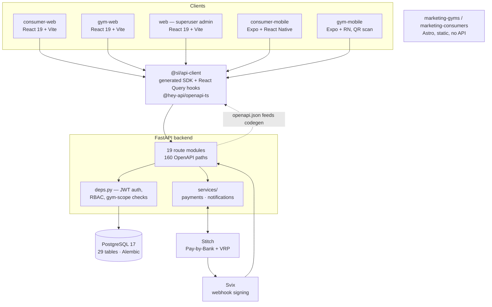

# StudioLoop

A multi-tenant gym and fitness-studio management platform — class scheduling, bookings,
memberships, and bank-based payments — built for independent studios in South Africa.

## Status: parked

Worked on from **22 January 2026 to 2 April 2026** (120 commits on `master`, single author).
Most of the work landed in the first six weeks: 67 commits in January, 44 in February, 8 in
March, and a final `chore: final state before parking project` on 2 April.

It was parked before going live. Nothing ever processed a real payment and it never had a
paying tenant. What exists is a working local system: 26 Alembic migrations, 29 table models,
19 route modules serving 160 OpenAPI paths, a 460-test backend suite that runs against real
Postgres in CI, five frontend apps, and a payment integration that authenticates against the
live Stitch API but was never configured to settle into a real bank account.

Read this as a snapshot of a mid-sized greenfield backend at the point where it worked
end-to-end locally and had not yet been hardened for production. The sections on
[hard problems](#the-hard-problems) and [what I would do differently](#what-i-would-do-differently)
are specific about which parts are solid and which are not.

## Architecture

A FastAPI backend over Postgres, and a pnpm/Turborepo frontend monorepo whose API layer is
generated from the backend's own OpenAPI schema.



**Backend** — FastAPI, SQLModel (Pydantic v2 + SQLAlchemy), Alembic, Postgres 17.
JWT HS256 with access/refresh rotation, Argon2 password hashing with bcrypt legacy verify,
four-role RBAC (`owner > manager > front_desk > instructor`).

**Frontend** — pnpm 10 workspaces + Turborepo 2. Three React 19 + Vite web apps, two Expo
React Native apps, two static Astro landing pages, and two shared packages.

**The generated client is the load-bearing piece.** `pnpm --filter @sl/api-client generate`
shells into the FastAPI app, dumps `app.openapi()`, and runs `@hey-api/openapi-ts` over it to
emit typed request functions *and* TanStack Query hooks — around 19,000 generated lines
covering 160 paths, 190 operations and 203 schemas. No hand-written API types anywhere in the
frontend.

**Deployment as configured** — backend on Railway (Johannesburg region, chosen for POPIA data
residency), frontends on Vercel, both via GitHub Actions. `docker-compose.yml` additionally
describes a self-hosted Traefik deployment (TLS via Let's Encrypt, `Host()` routing per
subdomain) inherited from the FastAPI template. It was never the deployment that ran, and it
cannot currently build: its `frontend` service declares `build: ./frontend` and there is no
`frontend/Dockerfile`. Treat it as reference, not a working path.
`docker-compose.local.yml` is the one used for development — Postgres, Redis and Adminer, all
bound to `127.0.0.1`, and it validates.

## The hard problems

### Multi-tenancy — solved by convention, not by the framework

Every tenant-owned table carries a `gym_id`. `backend/app/models/base.py` defines
`GymScopedModel` and `GymScopedSoftDeleteModel`, and 11 of 29 table models inherit one.
`backend/app/api/deps.py` provides `get_current_gym` / `get_current_staff_for_gym`, which
compare the authenticated staff member's `gym_id` against the `gym_id` in the URL path and
return 403 on mismatch.

**That is the whole guarantee.** There is no Postgres row-level security and no SQLAlchemy
query filter, despite the `GymScopedModel` docstring claiming "row-level security on all gym
tables" — that line is wrong and should be deleted. Actual isolation is 87 hand-written
`gym_id ==` predicates across 10 route files, plus 22 `session.get(Model, id)` calls that
cannot apply a tenant filter at all and are reconciled afterwards against a `gym_id` taken
from the request body.

The uncomfortable part: `backend/app/repositories/base.py` contains a `GymScopedRepository`
that *does* inject `gym_id` automatically on `get`/`get_multi`/`count`/`delete`, with a
constructor type guard and a ten-test suite proving cross-tenant reads and deletes are blocked
(`backend/tests/repositories/test_gym_scoped_repository.py`). **No route uses it.** The
correct mechanism was built and tested, then bypassed everywhere. Retrofitting the routes onto
it is the single highest-value piece of work left.

Two known isolation defects: `analytics.py` (`consumer_class_history`, `consumer_stats`) runs
`select(ClassSession)` with no predicate and filters in Python, pulling every tenant's sessions
into process memory; and both WebSocket endpoints in `realtime.py` take no auth dependency at
all, so anyone holding a session UUID can read another gym's waitlist.

### Payment provider abstraction — one real provider, two fakes that look real

`backend/app/services/payments/providers.py` defines a `PaymentProvider` Protocol
(`initiate` / `verify` / `refund`) returning dataclass results, with the implementation
selected at runtime from `settings.PAYMENT_PROVIDER`.

`StitchProvider` (`stitch.py`, 372 lines) is the real one, and the best code in the backend:

- OAuth2 client-credentials token fetch, cached with a 30-second expiry safety margin.
- Real GraphQL over `httpx`, with error unwrapping.
- Two distinct mutations for two distinct commercial cases —
  `clientPaymentInitiationRequestCreate` for one-off Pay-by-Bank (1-hour expiry), and
  `paymentConsentRequestCreate` for recurring debit consent (VRP) on memberships.
- A correct hand-rolled **Svix** signature verifier: 300-second timestamp tolerance, `whsec_`
  base64 key decode, `{id}.{timestamp}.{body}` signed content, `hmac.compare_digest`, and
  iteration over space-separated multi-version signatures.

Two things in it are not real, and both matter: the beneficiary bank account is the literal
placeholder `accountNumber: "0000000000"`, so no payment could ever have settled; and
`refund()` returns success without calling Stitch while the caller writes `mark_refunded()` to
the database. That combination is proof this path never ran against a live account.

`OzowProvider` and `PayFastProvider` are **in-repo fakes**, not integrations. Ozow is the
config default and the de-facto local development provider; its `verify()` computes an HMAC
over the app's own `SECRET_KEY`, so it validates a signature the app itself produced. There is
no HTTP call to either provider anywhere. This was the most misleading thing in the repository
before this README, because both are named after real South African payment providers.

### Webhook processing — idempotent by accident, and one real vulnerability

`POST /api/v1/payments/webhooks/{provider}` re-reads the raw request body rather than
re-serialising the parsed model before verifying the HMAC, which is the right instinct. For
Stitch it refuses partial Svix header sets instead of silently downgrading.

**Duplicate handling is incomplete.** There is a unique constraint, but on `event_id` alone
rather than `(provider, event_id)`. The idempotency check is a `SELECT` for an existing
`PaymentWebhookEvent` at the top of the handler; the matching `INSERT` happens roughly 110
lines later, after every side effect, in the same commit. That is a check-then-insert race:
two concurrent deliveries of the same `event_id` both pass the `SELECT` — nothing is locked,
`with_for_update` appears nowhere in the codebase — both run the side effects, one commit wins,
and the loser raises `IntegrityError`, which is never caught and surfaces as HTTP 500. It
converges only because providers retry and the retry hits the fast path, and because the
failed commit rolls back the loser's mutations. The payment is not double-completed, but that
is the database aborting the transaction rather than the code handling it. The fix is about
four lines: insert the event row first, catch `IntegrityError`, return 200.

A second defect in the same handler: a failed-signature attempt still writes a
`PaymentWebhookEvent` row for that `event_id` before returning 400, and the idempotency check
does not filter on `signature_valid`. So one bogus delivery permanently suppresses the
legitimate delivery of that event id.

**And the one I would fix before anything else:** `provider` is a path parameter, so the caller
chooses which verifier runs, and `PaymentWebhookRequest` still carries PayFast's stub field.
`POST /api/v1/payments/webhooks/payfast` with `{"verified": true}` and a known payment UUID
passes verification with no secret and no signature, then completes the payment, activates the
membership and issues a receipt. The production config check that forces
`PAYMENT_PROVIDER=stitch` does not help, because the route never reads that setting. This is a
genuine authentication bypass, and it is named here deliberately rather than left for a reader
to discover.

### Class scheduling — materialised occurrences, and no concurrency control

`ClassTemplate` holds reusable defaults; `ClassSession` is the concrete scheduled instance with
explicit `start_time`/`end_time`, `capacity`, a denormalised `spots_booked`, `approval_status`
and a `recurrence_group_id`. Recurrence is **generated rows, not RRULE**:
`create_recurring_sessions` takes a date range plus `days_of_week` and materialises one row per
occurrence (capped at 365 days), skipping space and instructor conflicts and reporting a
`skipped_conflicts` count. Simple and queryable; the cost is no series-level editing beyond
the group id and no exception/override model. `GymClosure` exists and is *not* consulted by the
scheduler, so recurring generation will happily create sessions on a public holiday.

The waitlist is coherent: `position`, `offered_at`/`expires_at`, and
`offer()`/`accept()`/`expire()` transitions, with an offer issued synchronously to the
lowest-position entry when a booking is cancelled.

**Booking a full class has no concurrency protection at all** — read `spots_booked`, compare to
`capacity`, increment, commit. No row lock, no unique constraint on
`(session_id, consumer_id)`, no `CHECK (spots_booked <= capacity)`, no version column. Under
Postgres' default `READ COMMITTED`, concurrent requests for the last spot all pass the check
and all increment, and last-writer-wins can leave the counter *below* the number of `Booking`
rows. `realtime.py` independently recomputes the same number from `COUNT(bookings)`, so there
are two disagreeing sources of truth. Not overselling a class is the one invariant a booking
product exists to uphold, and this does not uphold it. A `SELECT … FOR UPDATE` on the session
row, or a conditional `UPDATE … WHERE spots_booked < capacity RETURNING`, is the fix.

### The schema-drift migration

`30e9fafc9756_resolve_remaining_schema_drift.py` is the interesting one. Five tables
(`audit_logs`, `complaints`, `webhook_endpoints`, `credit_logs`, `webhook_deliveries`) existed
as SQLModel classes with no migration behind them — the platform-admin work had been written
against the ORM and never migrated. The same revision also corrects around twenty missing
indexes and converts table-level unique constraints into unique indexes, to match what
SQLModel's `Field(unique=True, index=True)` actually emits.

It was produced by `alembic revision --autogenerate` and merged with the
`# ### commands auto generated by Alembic - please adjust! ###` banner still in place, and it
shows: it silently dropped `ondelete='CASCADE'` from the `gym_closures.gym_id` foreign key —
its own `downgrade()` restores the cascade, which is how you can tell — reverting an earlier
migration's intent, because SQLModel's `foreign_key=` does not declare `ondelete`. Deleting a
gym now fails on a foreign-key violation instead of cascading. The lesson is the obvious one:
autogenerate proposes, it does not decide.

One thing that did stay clean: the migration graph. 26 revisions, one root (`e2412789c190`),
one head (`a1b2c3d4e5f6`), no branch points and no orphans — verified by parsing every
`revision`/`down_revision` pair.

### `models_legacy.py`

This is the unmodified `models.py` from `fastapi/full-stack-fastapi-template`, renamed rather
than deleted when the real domain models moved into `app/models/`. It is not dead code — it
still defines the `User` and `Item` tables, it is re-exported from `app/models/__init__.py`,
and the platform-admin layer genuinely authenticates against template `User`
(`audit_logs.admin_user_id → user.id`). But the `Item` table and `/items` router are pure
template demo code, they leak into the OpenAPI schema and therefore into the generated frontend
types, and roughly 54 of the 460 backend tests exercise template boilerplate rather than
StudioLoop. Three parallel identity models (`User`, `Consumer`, `Staff`) under two naming
conventions is the clearest sign the template was never fully absorbed.

## What is tested

**Backend: 34 test files, 460 test functions, no skips or xfails.** They run in CI on every
pull request against a real `postgres:16` service after `alembic upgrade head`, alongside
`ruff` and `mypy --strict` on `app/`. I have not re-run the suite while preparing this README,
so treat 460 as the count of tests defined, not a claim that all 460 currently pass.

Genuinely well covered:

| Area | Tests | Notes |
|---|---|---|
| `test_profile.py` | 32 | `/me` for both actor types, refresh-token-as-bearer rejection, full `+27` phone matrix |
| `test_password_reset.py` | 26 | No email enumeration, `token_version` session invalidation, cross-actor isolation |
| `test_gyms.py` | 25 | Registration, profile RBAC, tenant isolation, hours/closures, Space CRUD, CSV import |
| `test_admin.py` | 22 | Approve/reject/suspend, complaints, credits, audit log, superuser enforcement |
| `test_class_scheduling.py` | 20 | Space and instructor conflicts, recurrence, approval workflow, calendar range limits |
| `test_token_refresh.py` | 19 | Rotation, `token_version` increment, old-token rejection, all roles |
| `test_rbac.py` | 18 | The four-role allow/deny matrix, own-gym vs other-gym, no gym-id leakage in errors |
| `test_payments.py` | 17 | Initiation, webhook idempotency, retry worker, receipts, Svix invalid-signature rejection |
| `test_stitch.py` | 15 | Token cache/refresh, both mutations, HMAC and Svix edge cases — all HTTP mocked |

What is **not** covered, plainly:

- `routes/utils.py` is the only route module with zero tests.
- `services/payments/providers.py` — the entire provider abstraction, including both fakes and
  `get_payment_provider` — has no direct tests. The PayFast bypass described above lives in the
  one untested file.
- Staff Google/Apple OAuth endpoints: the OAuth suites only exercise the consumer URLs.
- `realtime.py` has 3 tests for 362 lines, and none of them test authentication.
- `deps.py` has 3 direct tests.
- No coverage gate. `pytest-cov` is not a dependency and CI never measures coverage.
- Tests are **not isolated**. A session-scoped autouse fixture runs `alembic upgrade head` and
  seeds the database once; suites then share mutable state and some import helpers from each
  other. `conftest.py` says so outright: *"cleanup has proven flaky due FK/lock ordering in
  session-scoped fixtures."*

Running the backend suite needs a live Postgres, not a throwaway one: a session-scoped
`autouse` fixture shells out to `uv run alembic upgrade head` and then seeds whatever database
your `.env` points at, and deliberately never cleans up. Point `.env` at anything you care
about and `pytest` will write to it. It must be run from `backend/`. No test needs network
access or third-party credentials — Stitch, Google, Apple and SMTP are all patched.

**Frontend: 17 test files — 11 unit (~25 cases) and 6 Playwright specs (19 tests).** Only about
four of the unit cases assert real logic (the 401 → refresh → retry-once path in
`configureApiClient.test.ts`); the rest are render and routing smoke tests. Two shared packages
ship `echo "No tests configured"` as their `test` script, so `turbo test` reports green on
workspaces that execute nothing. Five of the six Playwright specs intercept `**/api/v1/**` and
serve canned JSON — they are frontend integration tests, not end-to-end tests — and `e2e.yml`
is `workflow_dispatch`-only and describes itself as a placeholder.

## How to run it

What works without any third-party credentials: the database, the migrations, the backend API,
the whole test suite, and all five frontend apps against that backend. Payments run through the
`ozow` fake. Social login, email and real payments need credentials you would have to supply
yourself — see the table at the end of this section.

**Prerequisites** — Docker with Compose v2, Python 3.12 (pinned in `.python-version`),
[`uv`](https://docs.astral.sh/uv/), Node 20+, and `pnpm` 10. `mise.toml` pins the Python
version if you use [mise](https://mise.jdx.dev/).

```bash
# 1. Configuration. The backend reads ../.env relative to backend/, so this file
#    belongs in the REPOSITORY ROOT, not in backend/.
cp .env.example .env

# 2. Postgres, Redis and Adminer (all bound to 127.0.0.1)
docker compose -f docker-compose.local.yml up -d

# 3. Backend: install, migrate, seed, run
cd backend
uv sync --dev
uv run alembic upgrade head
uv run python scripts/seed.py          # synthetic demo gyms, staff and classes
uv run uvicorn app.main:app --reload   # http://localhost:8000/docs

# 4. Backend tests (needs the database from step 2 to be running)
uv run pytest -v

# 5. Frontend
cd ../frontend
pnpm install
pnpm dev
```

`pnpm dev` starts every app through Turborepo. To run one:
`pnpm --filter gym-web dev` (also `consumer-web`, `web`, `marketing-gyms`,
`marketing-consumers`). The Expo apps are `pnpm --filter consumer-mobile start`.

Default ports: API `8000`, `web` (superuser admin) `5173`, `gym-web` `5174`, `consumer-web`
`5175`, Adminer `8080`.

Regenerate the API client after changing any backend route or schema — the committed output is
not refreshed automatically, and it requires the backend's Python environment because the
script imports the app to dump its schema:

```bash
pnpm --filter @sl/api-client generate
```

**What needs credentials you will not have.** Everything below degrades rather than crashes, so
the app runs without all of it:

| Feature | Variables | Without it |
|---|---|---|
| Real payments | `STITCH_CLIENT_ID`, `STITCH_CLIENT_SECRET`, `STITCH_WEBHOOK_SECRET` | `PAYMENT_PROVIDER=ozow` uses the in-repo fake |
| Transactional email | `SMTP_HOST`, `SMTP_USER`, `SMTP_PASSWORD`, `EMAILS_FROM_EMAIL` | Email silently no-ops; password-reset tokens are still issued, so read them from the response or the database |
| Google sign-in | `GOOGLE_CLIENT_ID`, `GOOGLE_CLIENT_SECRET` | Those endpoints error; email/password login is unaffected |
| Apple sign-in | `APPLE_CLIENT_ID`, `APPLE_TEAM_ID`, `APPLE_KEY_ID`, `APPLE_PRIVATE_KEY` | Same |
| Error tracking | `SENTRY_DSN` | Disabled, and ignored entirely when `ENVIRONMENT=local` |

`ENVIRONMENT=local` is doing real work: outside `local` the config validator rejects
`changethis` secrets and requires `STITCH_WEBHOOK_SECRET`, and `ENVIRONMENT=production` refuses
to start unless `PAYMENT_PROVIDER=stitch`.

## Known issues a reviewer will hit

Being explicit about these rather than letting them be discovered:

- **CI is red on `master`.** `ruff format --check app/` wants 6 files reformatted,
  `ruff check app/` reports one `C416`, and `mypy app/` reports 29 errors across 13 files. A
  handful of those are real bugs rather than stub noise — several `order_by()` calls pass a
  Python `datetime` value where the model column was meant
  (`bookings.py:491`, `class_scheduling.py:768`, `:962`, `:1024`).
- **The seed script runs on every deploy.** `backend/scripts/prestart.sh` ends with
  `python scripts/seed.py`, and that script has no `ENVIRONMENT` guard, so a production deploy
  provisions demo accounts with known passwords (`staffpass123`, `password123`). This needs a
  guard before this project is ever deployed again.
- **`alembic upgrade head` works against a real empty database, but `--sql` offline mode does
  not.** `c4b7ce0c5a91_add_gym_membership_unique_constraint.py` calls `sa.inspect(bind)` inside
  `upgrade()`, which raises `NoInspectionAvailable` against a mock connection. It is the only
  migration that reflects the live schema.
- **`frontend/apps/web` is commented as the legacy app and is still the deployed admin
  surface** (`sl-admin` in the Vercel config). The label and the deployment disagree.
- The two Astro apps define no `lint`, `test` or `type-check` scripts, so `turbo` silently
  skips them.
- `AGENTS.md`-style contributor docs are no longer in the repository, so any instruction they
  carried (including a claim that CI passes) does not apply here.

## What I would do differently

**The things that are wrong, in the order I would fix them.**

1. **Make the webhook route read `settings.PAYMENT_PROVIDER` instead of a path parameter**, and
   delete the `verified` field from `PaymentWebhookRequest`. As written, the caller picks the
   verifier and the PayFast fake accepts `{"verified": true}`. Fake providers should not be
   reachable from an HTTP route at all.
2. **Lock the session row when booking.** `SELECT … FOR UPDATE`, plus a
   `CHECK (spots_booked <= capacity)` and a unique constraint on `(session_id, consumer_id)`.
   Then either drop the denormalised counter or make `COUNT(bookings)` the only source of
   truth — not both.
3. **Route everything through `GymScopedRepository`.** The automatic tenant filter exists and is
   tested; 87 hand-written `gym_id` predicates are 87 chances to forget one. And put auth on
   the WebSocket endpoints.
4. **Insert the webhook event row first, catch `IntegrityError`, return 200** — and make the
   uniqueness `(provider, event_id)`, and make the idempotency check respect `signature_valid`.
5. **Delete `models_legacy.py`'s `Item` model and the `/items` router**, and collapse `User`
   into the same identity model as `Staff`. Three identity tables inherited from a template is
   an architectural decision I never actually made.

**The structural thing I would change.** I generated a large planning corpus — epics, stories,
per-story QA checklists — and it outran the code. Five tables reached the ORM without a
migration, which is what happens when the artefact being tracked is a story document rather
than a working migration. I would keep the schema as the unit of progress and write far less of
everything else. That corpus is no longer in this repository; it contained more bytes than the
source code did.

**Also unfinished, honestly:**

- **Nothing is scheduled.** There is no Celery, APScheduler or arq, and not even FastAPI
  `BackgroundTasks`. Payment retries and waitlist-offer expiry are HTTP endpoints, and the
  retry runner is local-only. In a real deployment an unaccepted waitlist offer would block its
  spot forever. The state machines are coherent and nothing drives them.
- **The payment "state machine" is a misnomer.** Statuses are `VARCHAR` with no database
  constraint, and there is no transition guard anywhere — `mark_completed()` will run happily
  on a refunded payment. The migration named after the state machine only widens a column to
  nullable.
- **`POST /bookings/system/waitlist/expire_offers` has no auth dependency**, and it mutates.
- **`GymClosure` is not wired into the scheduler.**
- **`packages/utils` is a four-line stub** that all five apps declare as a dependency and none
  import. `packages/ui` is React Native only, so the three web apps cannot use its components
  and consume only its CSS tokens — one component at two call sites is the entire real usage.
  The ~300 lines of auth plumbing duplicated across five apps is exactly what should have lived
  in `packages/utils`.
- **Recurring sessions store UTC built from a bare local hour**, so an 06:00 class becomes
  06:00 UTC. Harmless for South Africa, wrong anywhere with daylight saving.
- **`apps/web/README.md` is still the create-vite template text**, and `apps/web` has two
  orphaned route files (`Register.tsx`, `Home.tsx`) that nothing imports.
- The marketing sites' imagery is AI-generated placeholder art, and the PNGs are unoptimised —
  they account for most of this repository's size.

## Repository layout

```
backend/
  app/
    api/routes/      19 route modules
    models/          SQLModel domain models (plus models_legacy.py, template leftovers)
    repositories/    GymScopedRepository — tested, unused
    services/        payments/ (Stitch + two fakes), notifications/
    alembic/         26 migrations, linear
    seed/            synthetic demo data
  tests/             34 files, 460 tests
frontend/
  apps/              consumer-web, gym-web, web, consumer-mobile, gym-mobile,
                     marketing-consumers, marketing-gyms
  packages/          api-client (generated), ui, utils
docs/                ARCHITECTURE.md, DECISIONS.md, FEATURES.md, stitch-integration.md
```

## License

No license file is attached, so default copyright applies and others have no right to reuse
this code. If that is not the intent, add a license.
