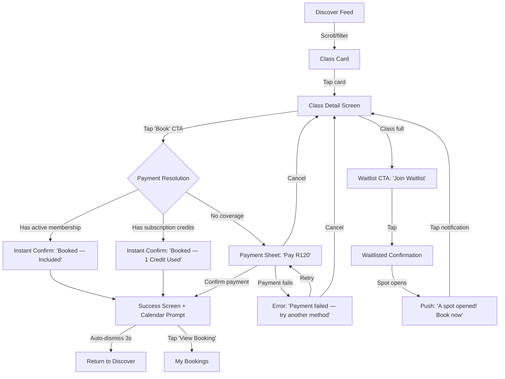
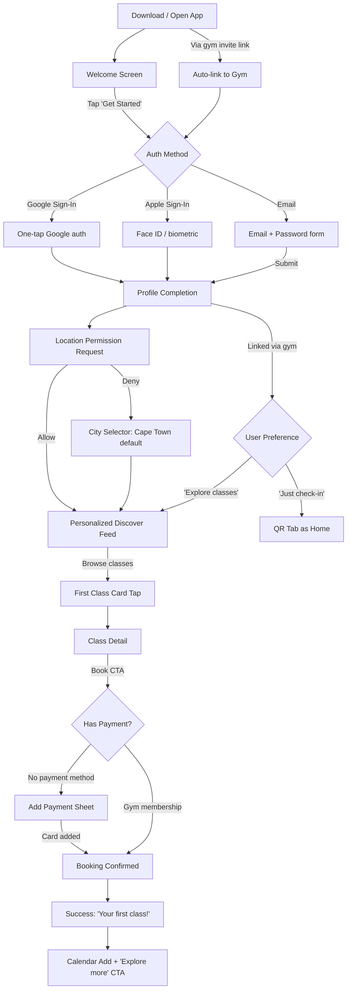
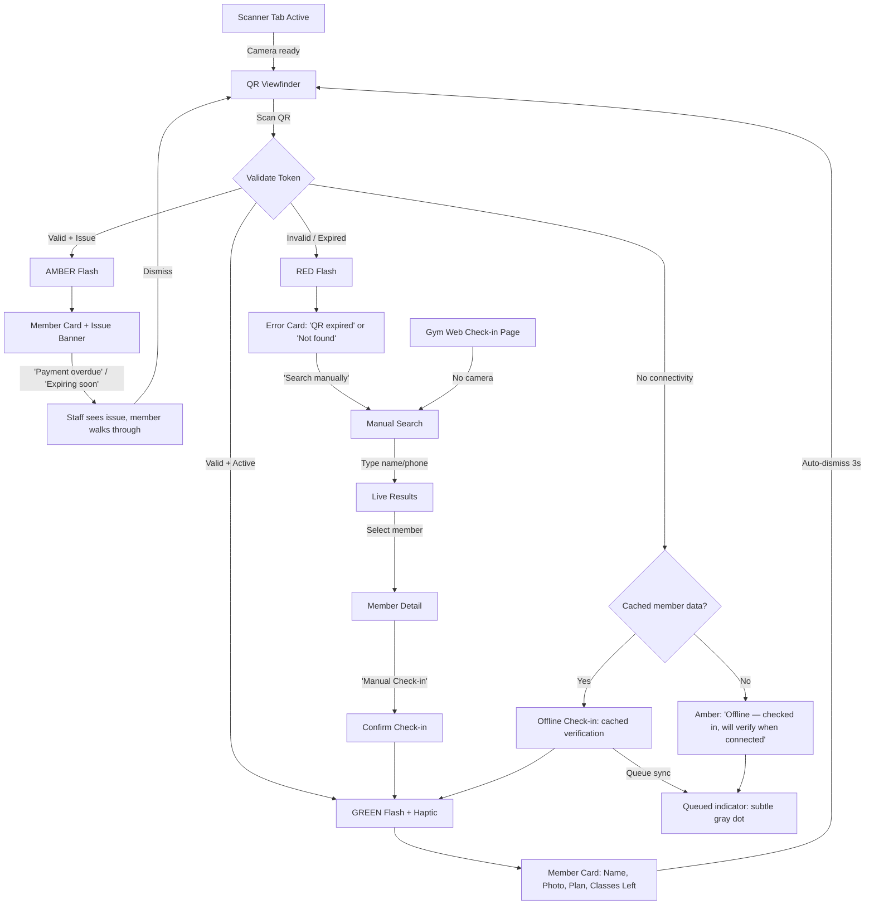
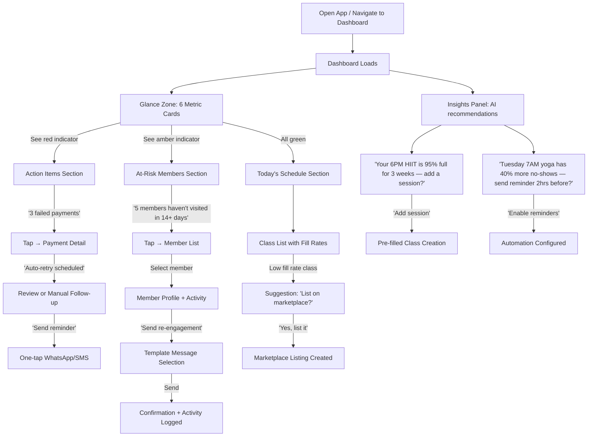
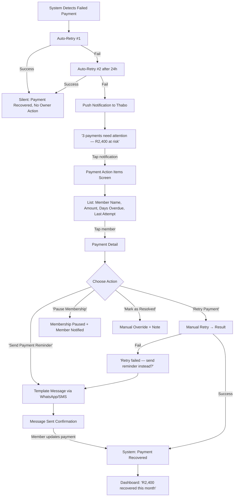

# UX Design Specification StudioLoop

**Author:** Ameen
**Date:** 2026-02-28

---

## Executive Summary

### Project Vision

StudioLoop is a six-application fitness marketplace and gym management platform targeting Cape Town, South Africa. The UX must serve a "trojan horse" strategy: affordable, premium-feeling gym management software earns gym owners' trust, forces their members onto the consumer app, and exposes them to a cross-gym class marketplace.

The UX challenge is unique: one platform must feel like a premium SaaS tool for business owners, an exciting discovery app for fitness consumers, and a fast operational tool for front-desk staff — all while sharing a coherent brand identity.

The existing codebase has functional auth flows, API-wired pages across 5 apps, and a 4-component shared UI package (`@sl/ui`). However, there is no unified design language — each app evolved independently with inline Tailwind, inconsistent color systems, no loading skeletons, and no dark mode. The UX overhaul will establish a comprehensive design system and apply it across all applications.

### Target Users

**Primary: Thabo (Gym Owner)** — 38, solo operator of a 120-member boutique gym. Drowning in 15+ hrs/week of admin. Loses R8,000/month from missed payments. Needs: an action-first dashboard that surfaces what matters, automated payment tracking, and churn prediction. UX priority: information density without overwhelm, daily glanceability on mobile, deep reporting when needed.

**Primary: Lerato (Fitness Consumer)** — 29, marketing professional seeking variety across studios without multiple memberships. Wishes ClassPass existed in Cape Town. Needs: fast discovery, 3-tap booking, transparent pricing. UX priority: visual card-based browse, smart defaults, frictionless booking, and a personalized "For You" feed.

**Primary: Nomsa (Gym Staff)** — 24, front desk + instructor. Deals with paper check-ins and awkward payment conversations. Needs: sub-3-second QR scan check-in, clear schedule/earnings view. UX priority: speed, reliability, offline capability, and zero ambiguity about member status.

**Secondary: David (Loyal Member)** — 52, only downloads the app because his gym requires it. Needs: simple QR check-in and payment management. UX priority: minimal learning curve, no marketplace clutter until he's ready.

### Key Design Challenges

1. **Split personality brand** — The B2B gym management side (premium SaaS tool) and B2C consumer side (accessible marketplace) require different emotional registers under one brand. Solution: shared typography and brand elements, but dark consumer theme with warm coral accent vs. light gym-owner theme with gold accent.

2. **Three booking methods, one flow** — Membership, subscription credit, and pay-per-class must coexist without confusing users. Smart defaults and progressive disclosure are essential.

3. **The forced adoption moment** — When a gym member is told "download this to check in," the first 60 seconds determine whether they engage with the marketplace or treat it as an annoyance. Onboarding must be instant-value, not friction.

4. **SA connectivity and data costs** — 84.9% Android market, data-cost-conscious users, spotty connectivity in some areas. Offline-first patterns, aggressive image optimization, and data-saver mode are not nice-to-haves — they're requirements.

5. **Information density spectrum** — Gym owners need dense dashboards and detailed reports. Consumers need spacious, visual discovery. Staff need fast, focused operational screens. One design system must span this entire range.

6. **Six applications, one system** — Web (React 19 + Tailwind v4), mobile (Expo + NativeWind v4), and marketing (Astro) must all feel like the same brand while respecting platform conventions.

### Design Opportunities

1. **Premium dark-mode consumer app as competitive moat** — No fitness marketplace in SA looks or feels premium. A dark, image-forward consumer experience immediately signals "this is different from spreadsheets and WhatsApp groups."

2. **Action-first gym dashboard with AI insights** — Moving beyond passive metrics to plain-language recommendations ("Your 6PM HIIT has been 95% full for 3 weeks — add a second session?") creates a stickiness that spreadsheets can never match.

3. **3-tap booking with smart defaults** — Discovery → Detail → Confirm with pre-selected payment method and automatic calendar add. Research shows this flow structure produces the highest conversion in fitness booking apps.

4. **Visual class discovery** — Image-led cards with price, time, distance, and spots remaining visible at the card level (no tap required for decision-critical info) creates a browse experience that competes with international apps.

5. **Unified design token system** — Building a proper token-driven design system in `@sl/ui` lifts all 6 apps simultaneously and accelerates development. Shared colors, typography, spacing, and components across web and mobile from a single source of truth.

6. **Offline-first as a feature** — QR check-in that works without signal, cached class schedules, and queued bookings that sync on reconnect turn SA's connectivity challenge into a product differentiator: "StudioLoop works even when your signal doesn't."

## Core User Experience

### Defining Experience

StudioLoop operates three distinct but interconnected core loops:

**Consumer Core Loop: See → Want → Book → Show Up**
The consumer experience is a discovery-driven booking loop. Users browse visually, make gut decisions based on class imagery and instructor reputation, book in 3 taps (Discover → Detail → Confirm), and check in with a QR code. The entire cycle from "I'm bored with my routine" to "I'm checked into a new studio" should take under 60 seconds.

**Gym Owner Core Loop: Glance → Understand → Act**
The owner experience is an action-first monitoring loop. The dashboard surfaces what needs attention (failed payments, at-risk members, popular classes that need a second session), provides context ("8 members haven't visited in 14+ days"), and offers one-click actions ("Send re-engagement message"). The goal is to compress 15 hours/week of admin into 15 minutes/day of informed action.

**Staff Core Loop: Scan → Confirm → Next**
The staff experience is a speed-optimized operational loop. QR scan check-in must complete in under 3 seconds. Manual member search must surface results as-you-type. The member's status (active membership, payment current, classes remaining) must be instantly visible with no interpretation required. Green means go, red means stop.

### Platform Strategy

| Platform | Primary User | Primary Mode | Theme Default | Key Constraint |
|----------|-------------|-------------|---------------|----------------|
| **Consumer Mobile** (Expo) | Lerato, David | Touch, one-handed | Dark | Offline QR, data efficiency |
| **Consumer Web** (React) | Lerato | Mouse + touch | Dark | Desktop discovery layout, responsive |
| **Gym Web** (React) | Thabo | Mouse, desktop-first | Light | Information density, daily use |
| **Gym Mobile** (Expo) | Nomsa | Touch, one-handed | Dark | Camera (QR scan), offline check-in queue |
| **Admin Web** (React) | Platform operators | Mouse, desktop | Light | Data tables, system management |
| **Marketing** (Astro x2) | Prospects | Scroll + CTA | Dark (consumer) / Light (gym) | SEO, page speed, conversion |

**Cross-platform rules:**
- All platforms share a single design token system (colors, typography, spacing, radii, shadows) from `@sl/ui`
- Components adapt to platform conventions (bottom tabs on mobile, sidebar on desktop, top nav on consumer web)
- Dark/light theme toggle available on all platforms; defaults are set per-platform based on usage context
- Offline capability is a first-class concern on all mobile apps; web apps use optimistic UI patterns

### Effortless Interactions

**1. Zero-thought booking**
Smart defaults eliminate decisions: the system pre-selects the best payment method (active membership > subscription credits > pay-per-class), pre-fills location from device GPS, and pre-sorts classes by the user's demonstrated preferences. The user's job is to scroll and tap, not configure and decide.

**2. Invisible check-in**
QR scan triggers immediate visual + haptic confirmation and auto-dismisses. No "Confirm Check-in?" dialog. No loading spinner. The staff member sees the green checkmark, the member walks through. If offline, the check-in queues silently and syncs later — nobody knows the difference.

**3. Passive intelligence for owners**
The dashboard doesn't wait for the owner to ask questions. It surfaces insights proactively: "Your Tuesday 7AM yoga has 40% more no-shows than other slots — consider a reminder 2 hours before?" Payment collection happens automatically; the owner only sees the results. Churn risk is flagged before the member even considers leaving.

**4. Contextual pricing transparency**
Every class card shows the cost to THIS user, not a generic price. If Lerato has a subscription with 3 credits remaining, the card shows "1 credit" not "R150." If David has an unlimited membership, the card shows "Included" not a price. The system does the math so the user doesn't have to.

**5. Progressive marketplace exposure**
David, who only wants check-in, isn't bombarded with marketplace content. The app starts as a simple membership tool. After 2 weeks, a subtle "Classes you might like" section appears on the home screen. After a month, the Discover tab gets a notification dot. The marketplace reveals itself at the pace of the user's readiness.

### Critical Success Moments

| Moment | User | Target Time | What Success Looks Like |
|--------|------|-------------|------------------------|
| **First QR check-in** | David | <30s from app open | Shows QR immediately after login, scans at gym, walks through |
| **First class discovery** | Lerato | <10s of browsing | Sees a class she wants at a studio she's been curious about |
| **First booking** | Lerato | 3 taps from discovery | Book → Confirmation with calendar prompt, feels instant |
| **First dashboard glance** | Thabo | <5s to understand business health | 6 metric cards, green/red indicators, action items count |
| **First caught payment** | Thabo | Within first 30 days | Alert: "We flagged R2,400 in failed payments" — the aha moment |
| **First marketplace class** | David | After 2-4 weeks of regular use | Notices "Yoga near you — R80" on home, curiosity wins |
| **First staff check-in** | Nomsa | <3s scan-to-confirmation | Scans QR, green flash, member name appears, done |

### Experience Principles

**1. Speed is the feature.**
Every interaction has a time budget. Check-in: 3 seconds. Booking: 3 taps. Dashboard comprehension: 5 seconds. If a flow takes longer than its budget, it's a bug, not a feature request. We measure and optimize interaction speed as a core metric.

**2. Show, don't ask.**
Smart defaults over configuration dialogs. Pre-selected payment methods over radio buttons. Personalized feeds over search-first interfaces. The system should feel like it already knows what the user wants. When we must ask, we ask once and remember forever.

**3. Earn attention, don't demand it.**
The marketplace reveals itself progressively. Notifications are earned through value, not spammed for engagement. David's home screen starts simple and grows richer as his usage deepens. Gym insights appear because they're useful, not because we need to fill whitespace.

**4. Offline is not an error state.**
In South Africa, connectivity is a spectrum, not a binary. QR codes work offline. Class schedules cache locally. Bookings queue and sync. The app never shows a "No internet connection" error screen — it shows a subtle indicator and keeps working.

**5. One brand, two registers.**
Consumer-facing surfaces (mobile apps, consumer web, marketing) speak with energy, warmth, and accessibility. Gym-facing surfaces (gym web, gym mobile, B2B marketing) speak with authority, precision, and premium quality. Both are unmistakably StudioLoop — same typography, same logo treatment, same motion language — but the emotional register shifts to match the audience.

**6. Data serves action.**
Every metric on the gym dashboard has a "so what?" attached to it. "73% retention" is a number. "73% retention — 12 members haven't visited in 3+ weeks → Send re-engagement" is a tool. We never show data without suggesting what to do about it.

## Desired Emotional Response

### Primary Emotional Goals

**Consumer (Lerato, David): "This is mine."**
The consumer app should feel like a personal concierge — not a marketplace. The emotional target is *ownership and belonging*. "My classes, my studios, my fitness life — all in one place." The premium dark aesthetic reinforces exclusivity ("I have access to something special") while the warm coral accents inject energy and approachability ("...and it's not intimidating").

**Gym Owner (Thabo): "I've got this."**
The gym management dashboard should feel like *calm competence*. Thabo is overwhelmed by spreadsheets and WhatsApp chaos. The emotional target is control without effort — "I can see everything, I understand what matters, and I know what to do next." The light theme with gold accents communicates professionalism and value ("this tool is worth paying for").

**Staff (Nomsa): "Smooth."**
The staff experience should feel like a well-oiled machine. No friction, no ambiguity, no awkward moments. The emotional target is *professional confidence* — "I look competent using this tool in front of members." The dark theme on mobile communicates modernity; the instant check-in response communicates reliability.

### Emotional Journey Mapping

| Stage | Consumer Emotion | Gym Owner Emotion | Staff Emotion |
|-------|-----------------|-------------------|---------------|
| **First open** | Curiosity + "this looks premium" | Relief + "finally, something modern" | "This is easy to figure out" |
| **Onboarding** | Excitement + personalization delight | Confidence + "this understands my business" | Speed + "I'm already productive" |
| **Daily use** | Anticipation + "what should I try next?" | Control + "everything's running smooth" | Flow + "just scanning, no thinking" |
| **Core action (book/check/manage)** | Satisfaction + instant gratification | Empowerment + "I caught that before it was a problem" | Pride + "that was seamless" |
| **Something goes wrong** | Trust + "it's handling it" (not panic) | Informed + "I see the issue and the fix" | Calm + "I have a fallback" |
| **Returning** | Habit + "let me check what's new" | Routine + "my morning dashboard check" | Automatic + muscle memory |
| **Telling others** | "You HAVE to try this app" | "It pays for itself" | "It makes check-in so easy" |

### Micro-Emotions

**Must cultivate:**

| Micro-Emotion | Where It Matters | Design Lever |
|---------------|-----------------|--------------|
| **Confidence** | Booking flow, payment, check-in | Clear confirmations, no ambiguous states, always show what happened and what's next |
| **Trust** | First-time payment, sharing personal data | Transparent pricing, security indicators, POPIA compliance messaging, real gym photos not stock |
| **Excitement** | Class discovery, first marketplace browse | Rich imagery, variety display, "X spots left" urgency, new class badges |
| **Accomplishment** | After booking, after check-in, monthly stats | Success animations, streak tracking, "You've attended 12 classes this month" celebrations |
| **Belonging** | Gym community, repeated visits | Personalized greetings ("Welcome back, Lerato"), studio familiarity signals, "Your studios" section |
| **Relief** | Failed payment auto-catch, churn prevention | "We handled it" messaging, proactive alerts framed as good news, not alarms |

**Must prevent:**

| Anti-Emotion | Trigger | Prevention |
|--------------|---------|------------|
| **Confusion** | Complex pricing, unclear booking status | Contextual pricing per-user, explicit status badges, progressive disclosure |
| **Anxiety** | Payment failures, cancellation fears | Clear refund policies shown pre-booking, no punitive language, graceful error recovery |
| **Frustration** | Slow loading, offline failures, dead ends | Skeleton loading, offline-first patterns, always provide a next action even on error |
| **Overwhelm** | Too many options, dense dashboards | Smart defaults, progressive marketplace reveal, role-appropriate information density |
| **Embarrassment** | Check-in rejection (expired membership) | Private status display (only staff sees the issue), tactful messaging ("Membership needs attention" not "PAYMENT FAILED") |

### Design Implications

**Emotion → Design Decision Mapping:**

1. **"This looks premium" → Dark theme + Outfit typeface + gold/coral accents + generous whitespace**
   The first emotional impression is purely visual. The premium luxe foundation (dark surfaces, luxury typography with thin weights on large numbers, disciplined single-accent-color system) creates an immediate "this is different" response. No competitor in SA fitness looks like this.

2. **"I've got this" → Action-first dashboard + plain-language insights + one-click actions**
   Control is communicated through clarity, not density. Six metric cards with green/red indicators are more empowering than 20 charts. Each insight ends with "→ [Action button]" so the owner never wonders "what do I do about this?"

3. **"That was seamless" → Sub-second feedback + haptic confirmation + auto-dismiss flows**
   Speed creates the feeling of smoothness. QR scan: haptic buzz + green flash + member name in <1s. Booking: tap → brief gold shimmer animation → "Booked!" with confetti-subtle particle effect. The micro-interactions do the emotional work.

4. **"It's handling it" → Offline queuing + optimistic UI + "synced" indicators**
   Trust during failures is built by never showing scary error states. Instead of "No connection!", show a subtle gray dot with "Offline — your actions are queued." When it syncs: subtle green pulse on the status indicator. The user feels protected, not abandoned.

5. **"You HAVE to try this" → Shareable class cards + referral rewards + streak celebrations**
   Word-of-mouth emotion requires moments worth sharing. A beautifully designed class card with the studio photo, class name, and "Lerato's booked — join her?" is both functional and social. Monthly stat summaries ("You tried 4 new studios this month!") create share-worthy moments.

### Emotional Design Principles

**1. Luxury is restraint.**
The premium feel comes from what we DON'T show, not what we add. Generous negative space. One accent color, not three. Thin type weights on large numbers. No competing visual elements fighting for attention. Every screen should have one clear focal point.

**2. Confidence through clarity.**
Every state is named. Every action has feedback. Every process has a visible outcome. Users should never wonder "did that work?" — the answer is always visible within 1 second. Loading states use skeletons shaped like the incoming content, not generic spinners.

**3. Warmth in a dark space.**
Dark themes risk feeling cold and impersonal. Counter this with: warm accent colors (coral for consumers, gold for gym owners), personalized greetings using first names, subtle radial gold glows on featured content, and photography that shows real people and real studios.

**4. Tactful in failure.**
When something goes wrong (payment failure, expired membership, full class), the messaging is solution-first: "Your payment method needs updating — [Update now]" not "PAYMENT FAILED." When a member's status is problematic at check-in, the details are shown privately to staff — the member only sees "Please see the front desk."

**5. Celebration is earned.**
We don't celebrate trivial actions (no confetti for logging in). But we DO celebrate genuine achievements: first booking at a new studio, 10-class streak, gym owner's first month with zero missed payments. These moments get subtle but delightful animations that respect the user's intelligence while acknowledging their progress.

## UX Pattern Analysis & Inspiration

### Inspiring Products Analysis

**1. Equinox+ (Premium Fitness)**
- **What they nail:** Dark-on-dark visual identity with high-contrast white text and minimal accent color. Photography is the hero — every screen feels like a fashion editorial. The premium feeling comes from restraint, not decoration.
- **Core UX lesson:** Negative space IS the luxury. Equinox shows fewer options per screen than competitors, but each option gets breathing room, large imagery, and clear typography. This creates a sense of curation rather than a catalog.
- **What to borrow:** The "editorial" card design — large hero image, minimal text overlay, generous padding. The way typographic weight (thin for large numbers, bold for labels) creates hierarchy without color.
- **What to avoid:** Their pricing opacity. Equinox hides costs behind login walls. StudioLoop should be the opposite — transparent pricing is a competitive advantage.

**2. Spotify (Discovery + Personalization)**
- **What they nail:** The "Discover Weekly" paradigm — the app learns what you like and surfaces it without you asking. The home screen is a personalized feed that changes daily, creating a reason to return. Dark theme feels natural for a media consumption context.
- **Core UX lesson:** Personalization that feels effortless. Users never configure preferences — the system observes behavior and adapts. The "Made for You" section creates emotional ownership ("this is MY mix").
- **What to borrow:** The personalized home feed concept. StudioLoop's consumer home should be "Your week" — curated classes based on booking history, preferred times, and favorite studios. Like Spotify's Daily Mixes, but for fitness.
- **What to avoid:** The "rabbit hole" navigation. Spotify's nested playlists and algorithmic paths can feel disorienting. StudioLoop needs clear, flat navigation — 4-5 tabs, no more than 2 levels deep.

**3. Linear (SaaS Dashboard)**
- **What they nail:** The fastest-feeling SaaS product ever built. Keyboard shortcuts, instant transitions, zero loading spinners. The dark theme feels like a power tool, not a fashion statement. Information density is high but never overwhelming because of consistent spacing and typography.
- **Core UX lesson:** Speed is perceived through animation, not just actual performance. Linear's 60fps transitions and instant state changes make it *feel* faster than it is. Every action has immediate visual feedback.
- **What to borrow:** The sidebar navigation pattern for gym-web — collapsible sections, keyboard-shortcut-ready, active state highlighting. The "command palette" concept (Cmd+K) for power users who want to jump directly to a member or report.
- **What to avoid:** Linear's learning curve. It assumes technical users. Gym owners are not technical. Keep the power features discoverable but not required.

**4. Uber (Booking + Real-time)**
- **What they nail:** The booking flow is the gold standard — destination → confirm → done. Three steps, massive buttons, impossible to get lost. Real-time status updates create trust ("your ride is 3 minutes away" = "your class starts in 2 hours").
- **Core UX lesson:** The best booking flow is the shortest booking flow. Every additional screen between "I want this" and "I have this" loses 20% of users. Smart defaults (saved payment, saved address) eliminate re-entry.
- **What to borrow:** The 3-step booking flow for class booking. The real-time status concept for "Your upcoming class" — showing a countdown, the studio location on a map, and the instructor photo.
- **What to avoid:** Uber's surge pricing anxiety. Price changes create stress. StudioLoop's pricing should be stable and predictable.

**5. Notion (Progressive Complexity)**
- **What they nail:** Notion starts simple — a blank page. Features reveal themselves as the user needs them. A new user sees a clean interface; a power user sees a full workspace. Same product, different experiences based on usage depth.
- **Core UX lesson:** Progressive disclosure is the answer to the "simple vs. powerful" tension. Don't hide features — reveal them at the right moment.
- **What to borrow:** The progressive marketplace reveal strategy for David (loyal gym member). Day 1: just QR check-in. Week 2: "Classes you might like" appears. Month 1: full marketplace discovery. The app grows with the user.
- **What to avoid:** Notion's "blank canvas" problem. New users shouldn't face empty screens. StudioLoop should always show something useful — even if it's onboarding content or suggested actions.

### Transferable UX Patterns

**Navigation Patterns:**

| Pattern | Source | StudioLoop Application |
|---------|--------|----------------------|
| **Bottom tab bar (4-5 tabs)** | Spotify, Uber, ClassPass | Consumer mobile: Explore, My Bookings, QR, Profile. Gym mobile: Dashboard, Scanner, Schedule, Members |
| **Collapsible sidebar** | Linear, Notion | Gym web: 260px sidebar with section groups, collapses to icons on mobile breakpoint |
| **Sticky bottom CTA** | Uber, ClassPass | Class detail page: "Book Now — R120" fixed to viewport bottom, always visible |
| **Command palette (Cmd+K)** | Linear, Notion | Gym web: Quick jump to any member, class, report, or setting. Power user accelerator. |

**Interaction Patterns:**

| Pattern | Source | StudioLoop Application |
|---------|--------|----------------------|
| **3-step booking** | Uber | Discover → Detail → Confirm. No intermediate screens. |
| **Pull-to-refresh** | iOS/Android native | All mobile list screens (class feed, bookings, dashboard) |
| **Swipe actions** | iOS Mail, Tinder | Consumer bookings: swipe left to cancel, swipe right to rebook |
| **Skeleton loading** | Facebook, Linear | Every data-dependent screen shows content-shaped skeletons, never spinners |
| **Optimistic UI** | Linear, Notion | Booking confirmation appears instantly; syncs in background |
| **Haptic feedback** | Uber, Apple Pay | QR scan success: haptic buzz + green flash. Booking confirm: subtle pulse. |

**Visual Patterns:**

| Pattern | Source | StudioLoop Application |
|---------|--------|----------------------|
| **Image-led cards** | Equinox+, ClassPass | Class discovery: hero image (studio photo), title overlay, price badge |
| **Thin-weight large numbers** | Equinox+, mockups | Dashboard metrics, prices, credit counts — font-weight 200-300 for elegance |
| **Single accent color system** | Equinox+, Linear | Consumer: coral on dark. Gym: gold on light/dark. Never both on one screen. |
| **Status color consistency** | Linear, GitHub | Green = active/success. Amber = warning/expiring. Red = error/cancelled. Everywhere. |
| **Radial glow decorations** | Mockups | Subtle gold/coral glow pseudo-elements on featured cards for warmth |
| **Pill-shaped badges** | iOS, ClassPass | All status indicators, filter chips, category tags: border-radius 100px |

### Anti-Patterns to Avoid

| Anti-Pattern | Why It Fails | StudioLoop Prevention |
|-------------|-------------|----------------------|
| **Credit system confusion** (ClassPass) | Users can't mentally convert credits to value. "What does 4 credits MEAN?" | Always show credit cost AND rand equivalent side-by-side |
| **Hidden pricing** (Equinox, Mindbody) | Forces login to see costs. Creates distrust and abandonment. | Price visible on every class card in the discovery feed. No login required to browse. |
| **Notification spam** (most fitness apps) | "Come back!" push notifications feel desperate and get apps uninstalled. | Notifications only for genuinely useful events: booking reminders, waitlist promotions, payment issues. Never for marketing. |
| **Infinite scrolling discovery** (generic marketplaces) | Users scroll endlessly without deciding. No anchor points. | Sectioned discovery: "For You" → "Popular Near You" → "New Studios" → "Off-Peak Deals." Each section has 3-5 items + "See all." |
| **Generic empty states** ("No data yet") | Makes new users feel like the product is broken or empty. | Every empty state has a specific illustration, a clear message, and a CTA: "No bookings yet — [Discover your first class]" |
| **Dashboard data dump** (old-school SaaS) | 20 charts on one page. Owner can't find what matters. | Max 6 metric cards + 3 insight callouts on the dashboard. Reports section for depth. |
| **Mandatory onboarding tours** (many B2B tools) | "Click here, then here, then here" tooltips that users immediately dismiss. | Contextual hints that appear when the user first reaches a feature naturally. Dismissable, never blocking. |
| **Dark mode as color inversion** (lazy implementations) | White backgrounds become pure black. Images look wrong. Shadows disappear. | Purpose-built dark theme with layered surfaces (#0a0a0a → #1a1a1a → #2a2a2a), adjusted image overlays, and zero box-shadows. |

### Design Inspiration Strategy

**Adopt directly:**
- Equinox+ editorial card design with large imagery and thin-weight typography → Class discovery cards
- Uber's 3-step booking flow with sticky bottom CTA → Class booking
- Linear's skeleton loading and instant transitions → All data-loading screens
- Spotify's personalized "Made for You" feed → Consumer home "Your Week"
- Notion's progressive feature reveal → Marketplace exposure for gym-only members

**Adapt for StudioLoop:**
- Linear's sidebar → Gym web sidebar with role-based section visibility (owner sees everything, instructor sees schedule + members)
- Uber's real-time tracking → Class countdown with studio map, instructor info, and "Leave in 15 min" nudge
- ClassPass's credit system → Always dual-display (credits + rand value), pre-select best payment method
- Equinox+ dark aesthetic → Split into two registers: warm coral (consumer) and gold (gym owner/staff)

**Avoid entirely:**
- ClassPass's credit-only pricing (always show rand value)
- Mindbody's feature overload (progressive disclosure, not everything-at-once)
- Generic fitness app notification spam (value-driven notifications only)
- Dashboard data dumps (action-first with progressive drill-down)
- Mandatory onboarding tours (contextual hints, never blocking modals)

## Design System Foundation

### Design System Choice

**Approach: Token-Driven Custom System on Tailwind/NativeWind**

Expand the existing `@sl/ui` shared package from its current 4 components (Button, Input, Card, Modal) into a comprehensive design system with ~25 components, driven by a unified design token layer that serves both Tailwind v4 (web) and NativeWind v4 (mobile).

This is not adopting an external design system. This is building StudioLoop's own design system on top of the existing Tailwind infrastructure, using the premium luxe direction as the visual foundation.

### Rationale for Selection

| Factor | Analysis | Decision Impact |
|--------|----------|----------------|
| **Existing infrastructure** | Tailwind v4 + NativeWind v4 already installed and configured across all 6 apps | Build on what exists, don't replace |
| **Cross-platform requirement** | React 19 (web) + Expo/React Native (mobile) — no single component library covers both | Tailwind/NativeWind is the only styling system that spans web + mobile natively |
| **Visual uniqueness** | Premium luxe aesthetic (dark layered surfaces, Outfit typeface, gold/coral accents) is too distinctive for off-the-shelf libraries | Custom tokens + custom components are required |
| **Team size** | Solo developer — needs maximum leverage from shared components | 25 well-built shared components save more time than 100 poorly-configured library overrides |
| **Maintenance** | Own code is easier to debug than forked library themes | Full ownership of every component |
| **Performance** | Tailwind generates only used CSS. No runtime style computation. | Lighter than any CSS-in-JS component library |

### Implementation Approach

**Phase 1: Design Tokens (Foundation)**
Redefine `@sl/ui/src/tokens/` with the complete premium luxe token system:

```
tokens/
├── colors.ts          # Dark/light theme palettes, semantic colors, accent colors
├── typography.ts       # Outfit font family, size scale, weight scale, letter-spacing
├── spacing.ts          # 4px base unit scale (4, 8, 12, 16, 24, 32, 48, 64)
├── radii.ts            # Border radius scale (8, 12, 16, 20, 24, 100px pill)
├── shadows.ts          # Elevation system (border-only for dark, subtle shadows for light)
├── animation.ts        # Duration, easing, transition presets
└── breakpoints.ts      # Responsive breakpoints matching Tailwind defaults
```

These tokens feed into:
- `theme.css` — Tailwind v4 CSS custom properties (`--color-primary-500`, etc.)
- `tailwind.config.js` — NativeWind preset for mobile apps
- TypeScript exports — For programmatic access in components

**Phase 2: Component Library Expansion (~25 components)**

| Category | Components | Priority |
|----------|-----------|----------|
| **Primitives** | Button, Input, TextArea, Select, Checkbox, Toggle, Radio | P0 — used everywhere |
| **Layout** | Card, CardHeader/Content/Footer, Divider, Stack, Grid | P0 — structural |
| **Feedback** | Modal, Toast, Alert, Skeleton, Spinner, ProgressBar | P0 — loading/error states |
| **Navigation** | TabBar, Sidebar, NavLink, Breadcrumb, BottomSheet | P0 — app chrome |
| **Data Display** | Badge, Avatar, Stat, Table, EmptyState, StatusDot | P1 — dashboard/lists |
| **Overlays** | Dropdown, Popover, Tooltip, ActionSheet | P1 — interactions |
| **Domain** | ClassCard, MetricCard, MemberRow, BookingConfirmation | P2 — StudioLoop-specific |

Each component ships with:
- Dark and light theme variants (via CSS custom properties, not props)
- Size variants where applicable (sm, md, lg)
- Accessible by default (ARIA attributes, focus management, keyboard nav)
- Cross-platform (React Native primitives with NativeWind, web-compatible)

**Phase 3: Theme System**

Two theme modes, switchable via CSS class on root element:

```css
/* Dark theme (consumer default) */
[data-theme="dark"] {
  --surface-0: #0a0a0a;    /* Page background */
  --surface-1: #1a1a1a;    /* Card background */
  --surface-2: #2a2a2a;    /* Elevated surface */
  --surface-3: #3a3a3a;    /* Borders, dividers */
  --text-primary: #f0f0f0;
  --text-secondary: #8a8a8a;
  --accent: var(--coral-500);  /* Consumer accent */
}

/* Light theme (gym owner default) */
[data-theme="light"] {
  --surface-0: #f8f8fa;
  --surface-1: #ffffff;
  --surface-2: #f0f0f2;
  --surface-3: #e5e5e7;
  --text-primary: #1a1a1e;
  --text-secondary: #6b6b73;
  --accent: var(--gold-500);   /* Gym accent */
}
```

Components reference semantic tokens (`--surface-1`, `--text-primary`, `--accent`) rather than raw colors, making theme switching a single class toggle.

### Customization Strategy

**Per-app accent color override:**
Each app sets its accent color at the root level:
- Consumer apps: `--accent: #FF6B4A` (coral) — energetic, approachable
- Gym apps: `--accent: #d4a855` (gold) — premium, authoritative
- Admin app: `--accent: #6366f1` (indigo) — neutral, professional

**Per-app theme default:**
- Consumer mobile/web: `data-theme="dark"` default, light toggle available
- Gym web/admin: `data-theme="light"` default, dark toggle available
- Gym mobile: `data-theme="dark"` default (dim studio environments)

**Component composition over configuration:**
Rather than prop-heavy mega-components, prefer small composable pieces:
```tsx
// Good: composable
<Card>
  <CardHeader>Class Name</CardHeader>
  <CardContent>...</CardContent>
  <CardFooter><Button>Book</Button></CardFooter>
</Card>

// Avoid: prop overload
<Card title="Class Name" footer={<Button>Book</Button>} variant="..." />
```

**Token-first development rule:**
No raw color values in application code. Ever. All colors come from tokens:
```tsx
// Good
className="bg-surface-1 text-primary border-surface-3"

// Forbidden
className="bg-[#1a1a1a] text-white border-[#3a3a3a]"
```

## Defining Core Experience

### The Defining Interaction

**StudioLoop's "Tinder swipe" equivalent: "See a class, book it, show up."**

If users were describing StudioLoop to a friend, it would be:
- **Consumer:** "You open the app, see classes near you, and book one in like 3 seconds."
- **Gym Owner:** "It tells me what's wrong before I even ask."
- **Staff:** "Just scan and they're in."

The defining experience that makes or breaks the business is the **consumer class discovery → booking flow**. This is the interaction where:
- Gym members first discover the marketplace (growth engine)
- Marketplace revenue is generated (business model)
- Cross-gym bookings happen (network effect)
- Word-of-mouth is triggered ("you have to try this app")

If this feels slow, confusing, or generic, the marketplace never takes off and StudioLoop remains just another gym management tool.

### User Mental Model

**How consumers currently solve this:**

| Current Approach | Mental Model | Friction |
|-----------------|-------------|----------|
| **Google "yoga near me"** | Search → Browse results → Visit website → Find schedule → Call/email to book | 5+ steps, 10+ minutes, often ends in abandonment |
| **Instagram discovery** | See studio's post → DM to ask about class → Wait for reply → Figure out payment | Async, unreliable, no real-time availability |
| **Friend recommendation** | Friend says "try X studio" → Google it → Navigate booking | Trust-based but still high friction to convert |
| **Walk-in** | Show up and hope there's space | Unpredictable, anxiety-inducing |

**The mental model StudioLoop must create:**
"I open the app, I see what's available, I tap Book, I show up." — identical to ordering an Uber. The user shouldn't need to understand membership tiers, credit systems, or payment methods. The system handles all of that behind a single "Book" button.

**Where confusion currently lurks:**
- Three payment methods (membership, subscription credits, pay-per-class) create decision paralysis
- Credit systems are mentally opaque ("how much is 1 credit worth?")
- Availability uncertainty ("is this class full? will I get in?")
- Cancellation anxiety ("what happens if I can't make it?")

### Success Criteria

| Criterion | Metric | Target |
|-----------|--------|--------|
| **Discovery to detail** | Time from app open to viewing a class detail | <5 seconds |
| **Detail to booked** | Taps from class detail to confirmed booking | 2 taps maximum |
| **Zero confusion** | % of users who complete booking without backtracking | >90% |
| **Price clarity** | Users can state what they paid within 5s of booking | 100% |
| **Cancellation confidence** | Users know the cancellation policy before booking | Shown pre-confirmation |
| **Return rate** | Users who book a second class within 14 days | >40% |
| **Share rate** | Users who share a class card with a friend | >10% within first month |

**The "just works" test:** A user who has never seen the app should be able to find and book a class within 30 seconds of their first authenticated session — without any onboarding tutorial.

### Novel UX Patterns

**Mostly established patterns, innovatively combined:**

The booking flow itself is an established pattern (ClassPass, Uber, OpenTable). The innovation is in **three areas:**

**1. Contextual Smart Pricing (Novel)**
Instead of showing a generic price, the booking button adapts to the user's situation:

| User State | Button Shows | Logic |
|-----------|-------------|-------|
| Has active gym membership at this studio | "Book — Included" | Membership covers it, zero cost |
| Has marketplace subscription with credits | "Book — 1 Credit (R80 value)" | Credits + rand equivalent |
| Has subscription, credits exhausted | "Book — R120 (or top-up credits)" | Upsell, but clear |
| No membership or subscription | "Book — R120" | Pay-per-class, straightforward |
| Class is full | "Join Waitlist — Free" | No payment until confirmed |

The user never selects a payment method. The system knows their state and presents the single best option. An "Other options" expandable section is available for edge cases.

**2. Progressive Marketplace Reveal (Novel)**
For David (gym-only member), the app initially hides marketplace complexity:

| Week | What David Sees | What's Hidden |
|------|----------------|---------------|
| 1 | Home: QR check-in + My Membership | Discover tab exists but is unpopulated |
| 2 | Home: QR + "Classes at your gym this week" section appears | Still gym-scoped |
| 3 | Home: "Other studios near you" row appears (3 classes) | Soft marketplace intro |
| 4+ | Discover tab gets notification dot, full marketplace unlocked | Full experience |

This prevents the "forced download user" from being overwhelmed while gently converting them to marketplace engagement.

**3. Real-time Social Proof (Adapted)**
Class cards show subtle social signals that create urgency and trust:
- "3 spots left" — amber urgency badge when capacity <20%
- "Lerato and 2 friends booked" — if friends are on the platform
- "12 people attending" — for classes with healthy fill rates
- "New studio" — badge for recently onboarded gyms
- "Popular" — badge for classes that fill >80% consistently

### Experience Mechanics

**The Complete Booking Flow (3 screens, 2 taps to book):**

**Screen 1: Discovery (Explore tab)**

*Initiation:* User opens app → lands on Explore tab (or Home with "Your Week" section)

*Layout:*
- Search bar at top (location-aware, debounced)
- Horizontal filter pills: class type (Yoga, HIIT, Boxing, etc.), time (Morning, Afternoon, Evening), distance
- Sectioned feed:
  - "For You" — personalized recommendations (3-5 cards)
  - "Popular Near You" — trending classes within 5km
  - "New Studios" — recently onboarded gym's classes
  - "Off-Peak Deals" — discounted classes (marketplace revenue driver)
- Each class card shows: studio photo (hero), class name, studio name, time + duration, instructor name, price/credit cost, spots remaining badge

*Interaction:* User scrolls → taps a class card

*Feedback:* Card press animation (subtle scale down 0.98), navigate to detail

---

**Screen 2: Class Detail**

*Layout (scrollable with sticky bottom CTA):*
- Hero image (studio photo, 40% viewport height, gradient fade to content)
- Class name (large, Outfit thin weight)
- Studio name + distance + "View studio" link
- Date/time + duration pill
- Instructor section: photo + name + bio (collapsible)
- "About this class" description
- Amenities/equipment needed
- Cancellation policy (always visible, not hidden)
- "Similar classes" section at bottom

*Sticky bottom bar:*
- Left: Price display (contextual — "Included" / "1 Credit" / "R120")
- Right: Primary CTA button ("Book Now" / "Join Waitlist")
- If user isn't logged in: "Sign in to book" — routes to auth, returns to this screen

*Interaction:* User taps "Book Now"

*Feedback:* Bottom sheet slides up with confirmation details (not a new screen)

---

**Screen 3: Booking Confirmation (Bottom Sheet overlay on Class Detail)**

*Layout:*
- Class name + time summary
- Payment method (auto-selected, shows what will be charged)
- "Change payment method" text link (expandable, rarely needed)
- Cancellation policy reminder (one line)
- "Confirm Booking" primary button (full width, gold/coral accent)

*Interaction:* User taps "Confirm Booking"

*Feedback sequence (under 1 second total):*
1. Button shows brief loading state (spinner inside button, 200ms max)
2. Bottom sheet transforms to success state:
   - Checkmark animation (Lottie, 400ms)
   - "You're booked!" heading
   - Class name + date/time
   - "Add to Calendar" button
   - "Share with friends" button
   - "Done" to dismiss
3. Haptic feedback on confirmation (medium impact)

*Error handling:*
- Payment fails: "Payment didn't go through — [Try again] or [Use different method]"
- Class filled during booking: "This class just filled up — [Join waitlist] or [See similar classes]"
- Network error: Booking queued optimistically, "Booking pending — we'll confirm when you're back online"

---

**The Complete Check-in Flow (1 interaction, <3 seconds):**

**Staff side (Gym Mobile):**
1. Open Scanner tab → Camera activates immediately (no permission dialog after first grant)
2. Member shows QR on their phone
3. Camera detects QR → instant decode → API call
4. Success: Full-screen green flash (200ms) + haptic buzz + member name + "Checked in" + membership status
5. Auto-dismiss after 2 seconds → camera ready for next scan
6. If offline: Same green flash, "Queued — will sync" subtle indicator, member name still shown

**Member side (Consumer Mobile/Web):**
1. Tap QR tab → QR code appears immediately (cached, no loading)
2. "Online" badge (green) or "Offline — still valid" badge (amber)
3. Show QR to scanner → phone vibrates on successful scan
4. Optional: "Check-in confirmed" push notification arrives

## Visual Design Foundation

### Color System

**Dual-Theme Architecture with Per-App Accent**

The color system uses semantic surface tokens that resolve differently per theme, plus app-specific accent colors. This ensures every component works in both dark and light mode without conditional logic.

#### Surface Palette (Dark Theme — Consumer Default)

| Token | Hex | Usage |
|-------|-----|-------|
| `--surface-0` | `#0a0a0a` | Page background |
| `--surface-1` | `#1a1a1a` | Cards, nav bars, sidebars |
| `--surface-2` | `#2a2a2a` | Elevated surfaces, input backgrounds |
| `--surface-3` | `#3a3a3a` | Borders, dividers, subtle separators |
| `--text-primary` | `#f0f0f0` | Primary text (not pure white — reduces eye strain) |
| `--text-secondary` | `#8a8a8a` | Secondary text, labels, timestamps |
| `--text-muted` | `#5a5a5a` | Disabled text, placeholder text |

#### Surface Palette (Light Theme — Gym Web Default)

| Token | Hex | Usage |
|-------|-----|-------|
| `--surface-0` | `#f8f8fa` | Page background |
| `--surface-1` | `#ffffff` | Cards, panels |
| `--surface-2` | `#f0f0f2` | Elevated surfaces, table headers |
| `--surface-3` | `#e0e0e3` | Borders, dividers |
| `--text-primary` | `#1a1a1e` | Primary text |
| `--text-secondary` | `#6b6b73` | Secondary text |
| `--text-muted` | `#a0a0a8` | Disabled, placeholder |

#### Accent Colors (Per-App)

| App Context | Accent | Hex | Rationale |
|-------------|--------|-----|-----------|
| **Consumer** (mobile + web) | Coral | `#FF6B4A` | Energetic, warm, approachable, high visibility on dark |
| **Gym Owner/Staff** (web + mobile) | Gold | `#d4a855` | Premium, authoritative, professional |
| **Admin** (platform ops) | Indigo | `#6366f1` | Neutral, technical, trustworthy |

Each accent has a full 10-shade scale for hover states, backgrounds, and subtle tints:

**Coral Scale (Consumer):**

| Shade | Hex | Usage |
|-------|-----|-------|
| 50 | `#FFF5F2` | Subtle backgrounds (light theme) |
| 100 | `#FFE8E2` | Badge backgrounds (light) |
| 200 | `#FFCABC` | Hover tints |
| 300 | `#FFA48F` | — |
| 400 | `#FF8A6E` | Hover state |
| 500 | `#FF6B4A` | **Primary accent** |
| 600 | `#E85A3A` | Active/pressed state |
| 700 | `#CC4A2E` | — |
| 800 | `#A63B24` | — |
| 900 | `#802D1B` | Dark variant |

**Gold Scale (Gym):**

| Shade | Hex | Usage |
|-------|-----|-------|
| 50 | `#FDF8ED` | Subtle backgrounds |
| 100 | `#F5E6C8` | Badge backgrounds |
| 200 | `#EDCF9B` | Hover tints |
| 300 | `#E6BC6A` | Hover state |
| 400 | `#DFB05F` | — |
| 500 | `#d4a855` | **Primary accent** |
| 600 | `#C09545` | Active/pressed |
| 700 | `#A67D38` | — |
| 800 | `#86642D` | — |
| 900 | `#6B5024` | Dark variant |

#### Semantic Colors (Shared Across All Themes)

| Token | Hex | Usage |
|-------|-----|-------|
| `--success` | `#22c55e` | Confirmed, active, checked-in, positive trends |
| `--success-subtle` | `rgba(34, 197, 94, 0.15)` | Success badge backgrounds |
| `--warning` | `#f59e0b` | Expiring, low spots, attention needed |
| `--warning-subtle` | `rgba(245, 158, 11, 0.15)` | Warning badge backgrounds |
| `--error` | `#ef4444` | Failed, expired, cancelled, negative trends |
| `--error-subtle` | `rgba(239, 68, 68, 0.15)` | Error badge backgrounds |
| `--info` | `#3b82f6` | Informational, upcoming, neutral status |
| `--info-subtle` | `rgba(59, 130, 246, 0.15)` | Info badge backgrounds |

#### Gradient System

All gradients use consistent 135-degree angle:

| Name | Definition | Usage |
|------|-----------|-------|
| `--gradient-card` | `linear-gradient(135deg, var(--surface-1), var(--surface-2))` | Featured cards, membership cards |
| `--gradient-accent` | `linear-gradient(90deg, var(--accent-500), var(--accent-300))` | Progress bars, shimmer effects |
| `--gradient-image-fade` | `linear-gradient(to top, var(--surface-0), transparent)` | Image overlay fades |
| `--glow-accent` | `radial-gradient(circle, var(--accent-500) 0%, transparent 70%)` at 8% opacity | Decorative card glows |

### Typography System

**Primary Typeface: Outfit**

Outfit is a geometric sans-serif that excels at both the ultra-thin weights (luxury feel on large numbers) and the heavier weights (readability for body text). It's free via Google Fonts, supports all Latin characters, and loads efficiently.

**Fallback Stack:** `'Outfit', -apple-system, BlinkMacSystemFont, 'Segoe UI', Roboto, sans-serif`

#### Type Scale

| Token | Size | Weight | Letter-Spacing | Line-Height | Usage |
|-------|------|--------|----------------|-------------|-------|
| `--text-display` | 42px | 200 | -0.5px | 1.1 | Hero headings (desktop) |
| `--text-h1` | 32px | 300 | 0px | 1.2 | Page titles, class detail title |
| `--text-h2` | 24px | 600 | 0px | 1.3 | Section headers, card titles |
| `--text-h3` | 20px | 600 | 0px | 1.3 | Subsection headers |
| `--text-h4` | 18px | 500 | 0px | 1.4 | Card titles (lists) |
| `--text-body` | 16px | 400 | 0px | 1.5 | Body text, descriptions |
| `--text-body-sm` | 14px | 400 | 0px | 1.5 | Secondary body, nav links |
| `--text-caption` | 12px | 500 | 0.5px | 1.4 | Labels, timestamps, metadata |
| `--text-overline` | 11px | 700 | 1px | 1.3 | Badges, section labels (UPPERCASE) |
| `--text-micro` | 10px | 600 | 1px | 1.2 | Bottom nav labels, tiny badges (UPPERCASE) |
| `--text-stat` | 36px | 200 | 0px | 1.1 | Dashboard metric numbers |
| `--text-price` | 24px | 300 | 0px | 1.2 | Prices, credit counts |

#### Typographic Rules

1. **Uppercase + letter-spacing** is reserved for: section labels (`--text-overline`), badges, navigation labels, and buttons. Body text is NEVER uppercase.
2. **Thin weights (200-300)** are reserved for large display numbers: stats, prices, credit counts. Never for body text or labels.
3. **Font-weight 600-700** is reserved for: section titles, button text, badges, and active navigation items.
4. **Font-weight 400-500** is the default for: body text, descriptions, nav links, and form content.

### Spacing & Layout Foundation

#### Spacing Scale (4px base unit)

| Token | Value | Usage |
|-------|-------|-------|
| `--space-0` | 0px | — |
| `--space-px` | 1px | Borders |
| `--space-0.5` | 2px | Micro gaps |
| `--space-1` | 4px | Tight internal padding |
| `--space-2` | 8px | Badge padding, tight gaps |
| `--space-3` | 12px | List item gaps, filter pill gaps |
| `--space-4` | 16px | Standard internal padding |
| `--space-5` | 20px | Card padding (standard) |
| `--space-6` | 24px | Card padding (generous), section gaps |
| `--space-8` | 32px | Page-level padding (desktop) |
| `--space-10` | 40px | Section separation |
| `--space-12` | 48px | Desktop sidebar/header padding |
| `--space-16` | 64px | Large section breaks |
| `--space-24` | 96px | Mobile bottom nav clearance |

#### Border Radius Scale

| Token | Value | Usage |
|-------|-------|-------|
| `--radius-sm` | 8px | Buttons (desktop), calendar events, action buttons |
| `--radius-md` | 12px | Inputs, search bars, sidebar nav items |
| `--radius-lg` | 16px | Cards (desktop), stat cards, tables |
| `--radius-xl` | 20px | Cards (mobile), session cards, class cards |
| `--radius-2xl` | 24px | Featured cards, QR container |
| `--radius-full` | 100px | Badges, pills, filter chips, progress bars |
| `--radius-circle` | 50% | Avatars, notification dots |

#### Elevation System

**Dark theme:** Elevation through layered surfaces + borders (no shadows)

| Level | Background | Border | Usage |
|-------|-----------|--------|-------|
| 0 (Base) | `--surface-0` | None | Page background |
| 1 (Card) | `--surface-1` | `1px solid var(--surface-3)` | Cards, nav bars |
| 2 (Elevated) | `--surface-2` | `1px solid var(--surface-3)` | Dropdowns, popovers |
| 3 (Modal) | `--surface-1` | `1px solid var(--surface-3)` | Modals (+ backdrop overlay) |

**Light theme:** Elevation through subtle shadows + borders

| Level | Background | Shadow | Usage |
|-------|-----------|--------|-------|
| 0 (Base) | `--surface-0` | None | Page background |
| 1 (Card) | `--surface-1` | `0 1px 3px rgba(0,0,0,0.06)` | Cards, panels |
| 2 (Elevated) | `--surface-1` | `0 4px 12px rgba(0,0,0,0.08)` | Dropdowns, popovers |
| 3 (Modal) | `--surface-1` | `0 8px 32px rgba(0,0,0,0.12)` | Modals |

#### Layout Grid

| Platform | Columns | Gutter | Margin | Max Content Width |
|----------|---------|--------|--------|-------------------|
| Mobile (<640px) | 1 | 16px | 24px | 100% |
| Tablet (640-1024px) | 2 | 20px | 32px | 100% |
| Desktop (>1024px) | 3-4 (content dependent) | 24px | 32px | 1280px |
| Gym dashboard | Sidebar 260px + fluid content | 24px | 32px | No max |

#### Animation & Motion

| Token | Duration | Easing | Usage |
|-------|----------|--------|-------|
| `--duration-fast` | 100ms | `ease-out` | Button press, toggle |
| `--duration-normal` | 200ms | `ease-in-out` | Hover states, focus rings, color transitions |
| `--duration-slow` | 300ms | `ease-in-out` | Page transitions, bottom sheet open/close |
| `--duration-emphasis` | 400ms | `cubic-bezier(0.34, 1.56, 0.64, 1)` | Success checkmark, celebration animations |

**Motion rules:**
- Hover: `translateY(-2px)` on buttons, `translateY(-4px)` on desktop cards
- Press: `scale(0.98)` on mobile card taps
- Focus: `ring-2 ring-accent-500` with `--duration-normal` transition
- Loading pulse: `opacity 0.5 → 1` at 2s infinite (skeleton shimmer)

### Accessibility Considerations

**WCAG 2.2 AA compliance targets:**

| Criterion | Requirement | StudioLoop Implementation |
|-----------|-------------|--------------------------|
| **Color contrast (text)** | 4.5:1 normal, 3:1 large text | `#f0f0f0` on `#0a0a0a` = 17.4:1 (dark). `#1a1a1e` on `#ffffff` = 16.8:1 (light). Both exceed AA. |
| **Color contrast (interactive)** | 3:1 against adjacent colors | Coral `#FF6B4A` on `#0a0a0a` = 5.3:1. Gold `#d4a855` on `#0a0a0a` = 7.2:1. Both pass. |
| **Focus indicators** | Visible focus ring on all interactive elements | 2px ring in accent color with 2px offset, visible in both themes |
| **Touch targets** | Minimum 44x44px | All buttons ≥44px height. Tab bar items ≥48px. Card tap targets are full card area. |
| **Motion sensitivity** | Respect `prefers-reduced-motion` | All animations disabled when `prefers-reduced-motion: reduce`. Functional transitions (page navigation) reduced to instant. |
| **Font sizing** | Minimum 14px for body text, 12px absolute minimum | Smallest text is `--text-micro` (10px) used only for nav labels and tiny badges, never for readable content. |
| **Color independence** | Never convey info by color alone | Status badges include text labels ("Active", "Expired"). Trends include arrows (↑/↓) alongside green/red. |
| **Screen reader** | All interactive elements labeled | ARIA labels on icon-only buttons, semantic HTML structure, role attributes on custom components. |

## Design Direction Decision

### Design Directions Explored

The project began with 5 style explorations in the `design-mockups-premium-luxe/` folder:
1. **Modern Minimal** — Clean iOS-native, blue accent on white. Rejected: too generic, no premium differentiation.
2. **Bold Vibrant** — Poppins, red/purple/yellow, energetic. Rejected: too playful for B2B trust, too chaotic for a platform spanning 6 apps.
3. **Dark Mode** — Inter, indigo/cyan on slate. Rejected: close but lacks the luxury typography and warmth.
4. **Warm Earthy** — DM Sans, burnt orange/green on off-white. Rejected: wellness-focused but doesn't communicate technology or modernity.
5. **Premium Luxe** — Outfit, gold on black, zero shadows, aggressive uppercase. Selected as foundation.

The Premium Luxe direction was then refined through research and competitive analysis into the final direction documented below.

### Chosen Direction

**Refined Premium Luxe with Dual-Theme Split**

The original Premium Luxe direction (dark surfaces, gold accent, Outfit typeface, zero shadows, uppercase letter-spacing) is adopted as the foundation with three strategic modifications:

1. **Split accent system:** Coral (`#FF6B4A`) for all consumer-facing surfaces, gold (`#d4a855`) for all gym/staff surfaces. The original used gold universally, which created a barrier for the approachable consumer marketplace.

2. **Light theme for gym web dashboard:** The original was dark everywhere. Research shows light themes improve data readability for information-dense SaaS dashboards used during business hours. Dark mode is available as a toggle.

3. **Semantic surface tokens:** Instead of raw hex values, all components reference `--surface-0` through `--surface-3` and `--text-primary`/`--text-secondary`, enabling theme switching via a single `data-theme` attribute.

### Design Rationale

| Decision | Rationale |
|----------|-----------|
| **Dark consumer default** | Aligns with Equinox+, Peloton, Nike Training Club. Makes photography pop. Premium signal. Works in dim gym environments. |
| **Light gym web default** | Gym owners use dashboards at desks during business hours. Dense data (tables, metrics, reports) reads better on light backgrounds. |
| **Coral consumer accent** | Gold creates exclusivity barrier inappropriate for an accessible marketplace. Coral is warm, energetic, visible on dark backgrounds, and distinct from every competitor's blue/purple. |
| **Gold gym accent** | Gold communicates "premium tool worth paying for" — exactly right for B2B SaaS positioning against cheap/free alternatives. |
| **Outfit typeface** | Geometric sans-serif that works at both ultra-thin (200) for luxury stat numbers and bold (700) for badges/buttons. Free via Google Fonts. |
| **Zero shadows (dark)** | Elevation through surface layering creates the restrained luxury feel. Shadows on dark backgrounds look artificial. |
| **Subtle shadows (light)** | Light themes need shadow elevation to differentiate surfaces. Kept minimal (1-3px blur for cards, 4-12px for elevated). |
| **Uppercase + letter-spacing** | The strongest luxury signal in the system. Reserved for labels, badges, nav items, and buttons — never body text. |

### Implementation Approach

**Reference mockups:** `_bmad-output/planning-artifacts/ux-design-directions.html`

**Implementation order:**
1. Update `@sl/ui` design tokens to match the refined palette
2. Build theme CSS (dark + light) with semantic surface tokens
3. Update existing components (Button, Input, Card, Modal) to use new tokens
4. Build new components per the Phase 2 component list
5. Apply to gym-web first (highest-priority B2B surface)
6. Apply to consumer-mobile (highest-priority B2C surface)
7. Roll across remaining apps (consumer-web, gym-mobile, admin-web, marketing sites)

Each app's entry point sets `data-theme` and `--accent` to configure its visual register.

## User Journey Flows

### Journey 1: Consumer Class Booking (3-Tap Flow)

**User:** Lerato (Fitness Consumer)
**Entry Point:** Discover tab (mobile) or Discover page (web)
**Success Criteria:** Book a class in ≤3 taps, under 10 seconds
**Payment Context:** System auto-selects best payment method



**Screen-by-Screen Detail:**

| Step | Screen | Key Elements | Time Budget |
|------|--------|-------------|-------------|
| **1. Browse** | Discover feed | Image cards with price/time/spots, filter chips (type, time, distance) | Scroll until interest (~5s) |
| **2. Detail** | Class detail | Hero image, instructor, schedule, spots remaining, smart price CTA | Scan + decide (~3s) |
| **3. Confirm** | Inline confirmation or payment sheet | Pre-selected payment method, one-tap confirm | Tap (~1s) |
| **Done** | Success overlay | Checkmark animation, calendar add prompt, auto-dismiss | Celebrate (~2s) |

**Smart Pricing CTA Logic:**
- Membership active for this gym → "Book — Included" (coral button)
- Subscription credits remaining → "Book — 1 Credit (R{value})" (coral button)
- No coverage → "Book — R{price}" (coral button) + "Other options" expandable
- Class full → "Join Waitlist — Free" (outline button)

---

### Journey 2: Consumer Onboarding → First Booking

**User:** Lerato (new user, invited by friend or gym requirement)
**Entry Point:** App store download or web signup
**Success Criteria:** From install to first booking in under 3 minutes
**Critical Moment:** The 60-second window after first open



**Onboarding Principles:**
- **No tutorial carousel.** Users learn by doing, not reading.
- **Social auth first.** Google/Apple buttons are largest. Email is "Other options."
- **Location = personalization.** One permission unlocks the entire feed. Worth asking.
- **Gym-linked users skip discovery.** If David comes via gym invite, his home is the QR tab.
- **First booking is guided.** Subtle pulse animation on first class card in feed. "Tap to see details" tooltip fades after 3s.

---

### Journey 3: Staff QR Check-in (Speed-Critical)

**User:** Nomsa (Front Desk Staff)
**Entry Point:** Scanner tab (gym mobile), Check-in page (gym web)
**Success Criteria:** Scan → Confirmation in under 3 seconds
**Offline Requirement:** Must work without connectivity



**Check-in States:**

| State | Color | Haptic | Sound | Message | Auto-dismiss |
|-------|-------|--------|-------|---------|-------------|
| **Active** | Green (#22c55e) | Strong buzz | Subtle chime | "Welcome, {Name}" | 3s |
| **Issue** | Amber (#f59e0b) | Light buzz | None | "Welcome — {issue}" | Manual |
| **Invalid** | Red (#ef4444) | Double buzz | None | "QR not recognized" | Manual |
| **Offline** | Gray dot indicator | Light buzz | None | "Checked in (syncing...)" | 3s |

**Key Design Decisions:**
- Camera is always active on Scanner tab — no "tap to scan" button
- Member photo displayed for visual verification (staff confirms right person)
- Amber states let the member through — payment issues are handled later, not at the door
- Offline check-ins queue silently via SQLite and sync when connectivity returns
- Manual search on web uses instant as-you-type search (phone number or name)

---

### Journey 4: Gym Owner Morning Dashboard

**User:** Thabo (Gym Owner)
**Entry Point:** Dashboard (gym web or gym mobile)
**Success Criteria:** Understand business health in under 5 seconds, take action in under 30 seconds
**Usage Pattern:** Daily morning check, ~2 minutes



**Dashboard Layout (Gym Web — Light Theme):**

| Zone | Content | Visual Treatment |
|------|---------|-----------------|
| **Header** | Gym name, today's date, notification bell | Surface-1, 64px height |
| **Metric Cards** (row) | Revenue MTD, Active Members, Check-ins Today, Retention %, Failed Payments, Classes Today | 6 cards in 3x2 grid, status color indicators |
| **Action Items** | Failed payments, expiring memberships, at-risk members | Card list with count badges, red/amber left border |
| **Today's Schedule** | Time blocks with class name, instructor, fill rate | Timeline view, fill rate as progress bar |
| **Insights** | AI-generated recommendations with action buttons | Gold accent left border, expandable cards |

**Mobile Adaptation:**
- Metric cards: horizontal scroll strip (2 visible, swipe for rest)
- Action items: stacked cards with swipe-to-act
- Schedule: vertical timeline, today only
- Insights: collapsed behind "Insights" section header, notification dot when new

---

### Journey 5: Forced-Download Onboarding (Progressive Reveal)

**User:** David (Loyal Gym Member, reluctant adopter)
**Entry Point:** Gym staff tells him to download the app
**Success Criteria:** From "I have to?" to "This is actually easier" in under 2 minutes
**Critical Design Goal:** Don't overwhelm. Don't push marketplace. Build trust first.

```mermaid
flowchart TD
    A[Download via Gym Link] --> B[Welcome: 'Set up your {Gym Name} membership']
    B -->|Google/Apple auth| C[Auto-linked to Gym]

    C --> D[Home Screen: QR Prominent]
    D --> E[QR Code Tab as Default Home]

    %% Week 1: Just check-in
    E --> F[Day 1-7: QR Tab + My Membership]
    F --> G[Simple bottom nav: QR, Membership, Profile]

    %% Week 2: Gentle class suggestion
    G -->|After 3+ check-ins| H[Home gets 'Your Gym's Classes' section]
    H --> I[Shows classes at David's gym only]

    %% Week 3-4: Marketplace peek
    I -->|After 2+ weeks active| J[Discover tab appears in nav]
    J -->|Notification dot: 'New'| K[Marketplace preview]
    K --> L['Classes near you' — familiar styles first]

    %% Optional upgrade
    L -->|Curiosity tap| M[Class Detail with pricing]
    M -->|Interest| N[Booking flow]

    %% The comfortable path
    F -->|Most sessions| O[Scan QR → Walk In → Done]
    O -->|Repeat| F
```

**Progressive Reveal Timeline:**

| Week | Nav Tabs | Home Content | Marketplace Exposure |
|------|----------|-------------|---------------------|
| **1** | QR, Membership, Profile | QR code + last check-in | None |
| **2** | QR, Membership, Profile | QR + "Your gym's classes this week" | None |
| **3** | QR, Discover, Membership, Profile | QR + gym classes + "Trending near you" (1 card) | Discover tab appears with "New" dot |
| **4+** | QR, Discover, Membership, Profile | Personalized home with gym + marketplace mix | Full marketplace access |

**Key Design Decisions:**
- Home screen is literally just the QR code for week 1 — big, centered, no clutter
- "Membership" tab shows plan details, payment status, renewal date — the stuff David actually cares about
- Marketplace content uses familiar class types first (if David does weights → show strength classes nearby)
- No push notifications about marketplace until week 3+
- The "Discover" tab notification dot only fires once — respect attention

---

### Journey 6: Payment Recovery (Aha Moment)

**User:** Thabo (Gym Owner)
**Trigger:** System detects failed payment
**Success Criteria:** From alert → recovered payment in under 2 minutes
**Emotional Target:** Relief + "the system caught this for me"



**Payment Action Item Card Design:**

```
+----------------------------------------------+
| * R800 overdue · 5 days                      |
|                                               |
| Sipho Ndlovu          Standard Plan           |
| Last attempt: 23 Feb — Card declined          |
|                                               |
| [Send Reminder]  [Retry Payment]  [...]       |
+----------------------------------------------+
```

- Red dot = 5+ days overdue, amber dot = 1-4 days
- "Send Reminder" is the primary action (most effective)
- "..." overflow menu has Pause Membership, Mark Resolved, View History
- Monthly recovery summary on dashboard: "R{amount} recovered this month" — this is the aha metric

---

### Journey Patterns

**Navigation Patterns Across Journeys:**

| Pattern | Where Used | Implementation |
|---------|-----------|----------------|
| **Tab-as-context** | Consumer mobile (QR tab = home for David), Gym mobile (Scanner tab = primary) | Default tab set by user type/behavior |
| **Action-first cards** | Dashboard action items, payment recovery, at-risk members | Card → tap → action, max 2 taps to resolution |
| **Progressive nav** | David's journey — tabs appear over time | Feature flags based on check-in count + days active |
| **Sticky CTA** | Class detail booking, payment sheets | Fixed bottom bar, always visible, context-aware label |

**Feedback Patterns Across Journeys:**

| Pattern | Where Used | Implementation |
|---------|-----------|----------------|
| **Traffic light status** | Check-in (green/amber/red), payment status, membership health | Consistent color coding across all apps |
| **Auto-dismiss success** | QR check-in, booking confirmation | Success states disappear after 3s, return to previous context |
| **Queued indicator** | Offline check-in, optimistic booking | Subtle gray dot / "syncing..." text, resolves silently |
| **Recovery summary** | Payment recovery, churn prevention | Cumulative "value saved" metric on dashboard |

**Decision Patterns Across Journeys:**

| Pattern | Where Used | Implementation |
|---------|-----------|----------------|
| **Smart default** | Payment method selection, location, class sorting | System picks best option, user can override |
| **Progressive disclosure** | Marketplace reveal, class detail pricing options | Show primary path first, "Other options" expandable |
| **Template actions** | Payment reminders, re-engagement messages, class suggestions | Pre-written templates with one-tap send |
| **Contextual suggestion** | Dashboard insights, marketplace listing prompt, session reminders | AI-generated recommendations with inline action buttons |

---

### Flow Optimization Principles

**1. Every flow has a time budget.**
Check-in: 3 seconds. Booking: 10 seconds. Dashboard comprehension: 5 seconds. Payment action: 30 seconds. If a flow exceeds its budget, remove steps — don't optimize individual steps.

**2. Error recovery is forward, not backward.**
When a payment fails, offer "Try another method" not "Go back." When a QR scan fails, offer "Search manually" not "Try again." Always move the user toward their goal, even through a different path.

**3. Offline is invisible.**
Users should never know they're offline unless it prevents an action. Check-ins queue. Schedules cache. The only visible offline indicator is a subtle status dot in the header — no modal, no toast, no banner.

**4. Celebration scales with achievement.**
First booking: confetti-subtle animation + "Your first class!" badge. 10th booking: "10 classes — you're on fire!" milestone card. Payment recovery: "R8,000 recovered this month" summary. Routine check-in: green flash, nothing more.

**5. Context determines complexity.**
David's home screen has 2 elements (QR + membership status). Lerato's has 8 (upcoming, recommendations, recent, stats). Thabo's has 12 (metrics, actions, schedule, insights). Same design system, different information density — determined by user behavior, not user configuration.

## Component Strategy

### Design System Coverage Analysis

**Currently Available in `@sl/ui` (4 components):**

| Component | Variants | Cross-Platform | Status |
|-----------|----------|---------------|--------|
| **Button** | primary, secondary, outline, ghost × sm/md/lg | Yes (Pressable) | Needs token update |
| **Input** | sm/md/lg with label/error/helper | Yes (TextInput) | Needs token update |
| **Card** | default, elevated, outlined + Header/Content/Footer | Yes (View) | Needs token update |
| **Modal** | sm/md/lg/full with overlay | Yes (RN Modal) | Needs token update |

**Current Token State:**
- Colors: Indigo-based primary (#5b6ff2) — needs replacement with coral/gold accent system
- Typography: System sans-serif + Inter display — needs Outfit typeface
- Spacing: Full Tailwind scale — good, keep as-is
- Theme: No dark/light toggle, no CSS custom properties for runtime theming

**Components Needed (from Journey Analysis):**

| Journey | Components Required |
|---------|-------------------|
| Consumer Booking (J1) | ClassCard, FilterChips, PriceBadge, StickyBottomCTA, SuccessOverlay, SkeletonLoader |
| Consumer Onboarding (J2) | SocialAuthButton, LocationPermissionSheet, OnboardingTooltip |
| Staff Check-in (J3) | QRScanner (existing), StatusFlash, MemberCard, SearchInput |
| Owner Dashboard (J4) | MetricCard, ActionItemCard, InsightCard, ProgressBar, TimelineBlock |
| Progressive Reveal (J5) | NavTabBar (adaptive), SectionReveal |
| Payment Recovery (J6) | PaymentActionCard, TemplateMessagePicker |

---

### Custom Components

#### ClassCard

**Purpose:** Primary discovery unit — how consumers browse classes across the marketplace.
**Usage:** Discover feed (mobile + web), home recommendations, gym class listings.

**Anatomy:**
```
+-----------------------------------------------+
| [Hero Image — 16:9 ratio]                     |
|                                                |
|   [Spots Badge: "3 left"]     [Price Badge]   |
+-----------------------------------------------+
| Studio Name · Instructor                       |
| Class Name                              TIME   |
| Distance · Duration                             |
+-----------------------------------------------+
```

**States:** default, loading (skeleton), booked (checkmark overlay), full (grayed + "Waitlist"), favorited (heart icon)
**Variants:** `compact` (list row, no image), `featured` (larger, radial glow accent), `default` (grid card)
**Accessibility:** Card is a single tappable region. Alt text on image. Price and spots announced by screen reader.

#### MetricCard

**Purpose:** Dashboard glance unit — one business health metric with status indicator.
**Usage:** Gym web dashboard (3×2 grid), gym mobile dashboard (horizontal scroll).

**Anatomy:**
```
+---------------------------+
| Label          [Status •] |
| VALUE                     |
| vs last period: +12%      |
+---------------------------+
```

**States:** default, positive (green indicator + up arrow), negative (red indicator + down arrow), neutral (gray), loading (skeleton)
**Variants:** `default` (standard), `action` (includes tap → action items count badge)
**Accessibility:** Status color backed by icon (up/down arrow) for color-blind users. Value announced as metric name + value + trend.

#### ActionItemCard

**Purpose:** Actionable alert — surfaces something that needs owner attention with one-tap resolution.
**Usage:** Dashboard action items section, payment recovery screen.

**Anatomy:**
```
+--[Status Border]------------------------------+
| [Icon] Title                     [Count Badge] |
| Description text                                |
| [Primary Action]  [Secondary Action]  [...]     |
+-------------------------------------------------+
```

**States:** urgent (red left border), warning (amber left border), info (blue left border), resolved (green, faded)
**Variants:** `compact` (title + count only, expandable), `full` (all details visible)
**Accessibility:** Urgency communicated via `aria-label` with severity level, not just color.

#### StatusFlash

**Purpose:** Full-screen momentary feedback for check-in results.
**Usage:** Gym mobile scanner tab, gym web check-in page.

**Anatomy:**
```
+-----------------------------------------------+
|                                                 |
|          [Large Icon: check/warning/error]      |
|          [Member Photo]                         |
|          Member Name                            |
|          Status Message                         |
|          Plan · Classes Left                    |
|                                                 |
+-----------------------------------------------+
```

**States:** success (green bg pulse), warning (amber bg pulse), error (red bg pulse), offline (gray with sync icon)
**Auto-dismiss:** Success and offline auto-dismiss at 3s. Warning and error require manual dismiss.
**Accessibility:** Announces result immediately via `aria-live="assertive"`. Haptic feedback on native.

#### FilterChips

**Purpose:** Horizontal scrollable filter selection for discovery and list screens.
**Usage:** Discover feed filters, member list filters, payment filters.

**Anatomy:** Horizontal scroll of pill-shaped chips: `[All] [Yoga] [HIIT] [Boxing] [Spin] [...]`

**States:** unselected (outline), selected (filled accent), disabled (grayed)
**Variants:** `single-select`, `multi-select`
**Accessibility:** Chip group uses `role="radiogroup"` (single) or `role="group"` (multi). Each chip is `role="radio"` or `role="checkbox"`.

#### StickyBottomCTA

**Purpose:** Always-visible action bar pinned to viewport bottom for critical conversion actions.
**Usage:** Class detail booking, payment confirmation, membership upgrade.

**Anatomy:**
```
+-----------------------------------------------+
| [Context text: "2 spots left"]  [CTA Button]  |
+-----------------------------------------------+
```

**States:** default, loading (button shows spinner), disabled (grayed), success (brief green flash then dismiss)
**Variants:** `simple` (button only), `context` (text + button), `dual` (two buttons side by side)
**Accessibility:** Sticky bar uses `role="complementary"` with descriptive label. Does not trap keyboard focus.

#### SkeletonLoader

**Purpose:** Content-shaped placeholder shown while data loads — replaces all spinners.
**Usage:** Every data-dependent screen across all apps.

**Variants:** `text` (line), `card` (ClassCard shape), `metric` (MetricCard shape), `avatar` (circle), `image` (rectangle), `custom` (children define shape)
**Animation:** Subtle shimmer pulse (left-to-right gradient sweep), 1.5s cycle, uses `prefers-reduced-motion` to disable.
**Accessibility:** `aria-busy="true"` on parent container. Hidden from screen reader (decorative).

#### PriceBadge

**Purpose:** Contextual price display that adapts to user's payment coverage.
**Usage:** ClassCard overlay, class detail, booking confirmation.

**Content logic:**
- Membership → "Included" (green badge)
- Subscription → "1 Credit" (accent badge)
- Pay-per-class → "R{price}" (default badge)
- Free → "Free" (green badge)

**Variants:** `overlay` (positioned on card image), `inline` (flow with text)
**Accessibility:** Full price context announced: "Included with your Premium membership" not just "Included".

#### InsightCard

**Purpose:** AI-generated recommendation with inline action button.
**Usage:** Gym dashboard insights panel.

**Anatomy:**
```
+--[Gold accent border]-------------------------+
| Insight text with specific data                 |
|                                                 |
| [Action Button: "Add session"]  [Dismiss: x]   |
+-------------------------------------------------+
```

**States:** new (accent glow), seen (no glow), dismissed (removed with undo toast), actioned (success confirmation)
**Accessibility:** `role="alert"` for new insights. Action button clearly labeled with outcome.

#### SearchInput

**Purpose:** Instant as-you-type search with live results dropdown.
**Usage:** Check-in manual search, member search, command palette.

**Anatomy:** Input field with search icon + live results list below, debounced at 200ms.
**States:** empty, typing (with clear button), results (dropdown visible), no-results ("No members found"), loading (inline spinner in input)
**Variants:** `inline` (results below input), `overlay` (full-screen on mobile), `command-palette` (Cmd+K modal)

#### NavTabBar

**Purpose:** Bottom navigation for mobile apps with adaptive tab count.
**Usage:** Consumer mobile, gym mobile.

**Key feature:** Tab count changes based on progressive reveal state (David starts with 3 tabs, grows to 4-5).
**States:** active (accent color + filled icon), inactive (gray), notification dot (new content available)
**Accessibility:** `role="tablist"` with `aria-selected` per tab. Badge count announced.

---

### Component Implementation Strategy

**Token Migration (applies to ALL components):**

Every component uses semantic CSS custom properties — never raw colors or hardcoded values:

```css
/* Component styling references tokens, not values */
.sl-button-primary {
  background: var(--accent);
  color: var(--text-on-accent);
}

.sl-card {
  background: var(--surface-1);
  border-color: var(--border);
}

.sl-metric-value {
  font-family: var(--font-display); /* Outfit */
  font-weight: var(--font-weight-extralight); /* 200 */
}
```

**Cross-Platform Strategy:**

| Layer | Web (React) | Mobile (Expo) |
|-------|------------|---------------|
| **Tokens** | CSS custom properties in `theme.css` | NativeWind CSS vars via `nativewind-env` |
| **Components** | React Native primitives via `react-native-web` | React Native primitives native |
| **Styling** | Tailwind v4 classes | NativeWind v4 classes |
| **Platform-specific** | `Platform.select()` for shadows, scrollbars | `Platform.select()` for haptics, safe areas |

**Composition Rules:**
1. Every component accepts `className` for style overrides (escape hatch, not primary API)
2. Variants are exhaustive — if a visual state exists, it's a prop, not a className hack
3. Components compose from primitives: `ClassCard` uses `Card` + `PriceBadge` + `SkeletonLoader`
4. No component has internal data fetching — all data passed via props
5. Loading states are built into every data-displaying component via `loading` prop

---

### Implementation Roadmap

**Phase 1 — Token Foundation + Existing Component Updates (Week 1)**

| Task | Details | Unblocks |
|------|---------|----------|
| Replace color tokens | Coral accent, gold accent, dark/light surface palettes | All components |
| Add Outfit typeface | Google Fonts import, font-family tokens | All text rendering |
| Add theme CSS | `[data-theme="dark"]` and `[data-theme="light"]` custom properties | Theme switching |
| Update Button | New token colors, new variants (accent uses `--accent`) | All CTAs |
| Update Input | Dark/light theme support, new focus ring colors | All forms |
| Update Card | Surface token backgrounds, remove hardcoded white | All card layouts |
| Update Modal | Dark overlay, themed content area | All dialogs |

**Phase 2 — Core Journey Components (Weeks 2-3)**

| Priority | Component | Critical For |
|----------|-----------|-------------|
| P0 | SkeletonLoader | Every screen (replaces all spinners) |
| P0 | ClassCard | Consumer discovery — the marketplace unit |
| P0 | StickyBottomCTA | Booking conversion |
| P0 | StatusFlash | Staff check-in |
| P0 | MetricCard | Owner dashboard |
| P1 | FilterChips | Discovery filtering |
| P1 | PriceBadge | Smart pricing display |
| P1 | SearchInput | Check-in manual search, member lookup |
| P1 | NavTabBar | Mobile navigation with progressive reveal |

**Phase 3 — Dashboard + Action Components (Week 4)**

| Priority | Component | Critical For |
|----------|-----------|-------------|
| P1 | ActionItemCard | Dashboard action items, payment recovery |
| P1 | InsightCard | AI recommendations on dashboard |
| P2 | TemplateMessagePicker | Payment reminders, re-engagement |
| P2 | ProgressBar | Fill rates, membership utilization |
| P2 | TimelineBlock | Today's schedule view |

**Phase 4 — Enhancement Components (Week 5+)**

| Priority | Component | Critical For |
|----------|-----------|-------------|
| P2 | SocialAuthButton | Onboarding (Google/Apple styled) |
| P2 | OnboardingTooltip | First-use guidance |
| P3 | CommandPalette | Gym web power users (Cmd+K) |
| P3 | StreakCelebration | Achievement animations |
| P3 | ShareCard | Referral/social sharing |

**Component Count Summary:**
- Existing (update): 4 components
- Phase 2 (new): 9 components
- Phase 3 (new): 5 components
- Phase 4 (new): 5 components
- **Total: ~23 components** in `@sl/ui`

## UX Consistency Patterns

### Button Hierarchy

**Rule: Every screen has exactly ONE primary action.**

| Level | Style | Usage | Example |
|-------|-------|-------|---------|
| **Primary** | Filled `--accent` bg, white text, full-width on mobile | The ONE thing we want the user to do | "Book Now", "Send Reminder", "Check In" |
| **Secondary** | `--surface-2` bg, `--text-primary` text | Important alternative action | "Join Waitlist", "View Details" |
| **Outline** | Transparent bg, `--accent` border + text | Tertiary or cancel-adjacent action | "Other Options", "Edit Profile" |
| **Ghost** | No bg, `--text-secondary` text | De-emphasized, always-available | "Skip", "Dismiss", "Cancel" |
| **Destructive** | Red bg (light) or red text (dark theme) | Irreversible actions only | "Delete Account", "Cancel Membership" |

**Button placement rules:**
- Primary action is always rightmost (desktop) or bottom (mobile)
- Destructive buttons are never primary-styled — always outline or ghost with red text
- Sticky bottom CTAs use primary style only
- Dual-button layouts: Primary right, Secondary left — never two primaries
- Loading state: spinner replaces label text, button width doesn't change

**Size usage:**
- `lg` — Sticky bottom CTAs, auth buttons, onboarding actions
- `md` — Standard in-page actions (default)
- `sm` — Table row actions, card inline actions, filter chips

---

### Feedback Patterns

**Rule: Every user action gets feedback within 300ms. No exceptions.**

#### Success Feedback

| Context | Pattern | Duration | Example |
|---------|---------|----------|---------|
| **Instant action** (check-in, bookmark) | Color flash + icon swap | 300ms flash, icon persists | Green flash on QR scan |
| **Async action** (booking, payment) | Optimistic update + confirmation overlay | Overlay auto-dismiss 3s | "Booked!" with checkmark |
| **Background action** (reminder sent, data saved) | Toast notification | Auto-dismiss 4s | "Reminder sent to Sipho" |
| **Milestone** (first booking, streak) | Celebration overlay | Manual dismiss or 5s | "Your first class!" with subtle animation |

#### Error Feedback

| Severity | Pattern | Persistence | Example |
|----------|---------|-------------|---------|
| **Field-level** | Inline red text below input | Until corrected | "Email is required" |
| **Form-level** | Banner above form | Until corrected | "Please fix 2 errors below" |
| **Action failure** | Toast with retry CTA | Manual dismiss | "Payment failed — [Try again]" |
| **System error** | Full-width banner top of page | Manual dismiss | "Connection issue — changes will sync when online" |

**Error message rules:**
- Solution-first: "Update your payment method" not "Payment method invalid"
- Never technical: "Something went wrong" not "Error 422: Validation failed"
- Always offer a next step: every error includes a CTA or instruction
- Tactful language for member-facing issues: "Membership needs attention" not "PAYMENT FAILED"

#### Loading Feedback

| State | Pattern | Never Do |
|-------|---------|----------|
| **Initial page load** | Skeleton loader matching content shape | Spinner |
| **Data refresh** (pull-to-refresh) | Native pull indicator | Replace content with skeleton |
| **Button action in-progress** | Button spinner (replaces label) | Disable without visual change |
| **Background sync** | Subtle gray dot in header | Modal blocker |
| **Long operation** (>3s) | Progress bar or step indicator | Nothing — user thinks it's broken |

---

### Form Patterns

**Rule: Forms are conversations, not interrogations.**

**Input styling (themed):**
- Default: `--surface-2` bg, `--border` border, `--text-primary` text
- Focus: `--accent` ring (2px), `--accent` border
- Error: `--error` ring, `--error` border, error text below
- Disabled: 50% opacity, no cursor change

**Validation rules:**
- Validate on blur (first interaction), then on change (subsequent)
- Show error messages below the field, not in tooltips or alerts
- Green checkmark appears when a previously-errored field is corrected
- Phone number: auto-format to SA format (+27) as user types
- Currency: auto-format to ZAR (R 1,234.56) with comma thousands separator
- Never clear user input on error — highlight what's wrong, don't delete their work

**Form layout:**
- Single column on mobile, always
- Max 2 columns on desktop for related fields (first name / last name)
- Labels above inputs, never inline/floating (clearer, better for accessibility)
- Required fields: no asterisk — instead, mark optional fields with "(optional)"
- Group related fields with subtle section headers

**Submit behavior:**
- Submit button shows spinner on press
- Disable form during submission (prevent double-submit)
- On success: navigate away or show success state (never stay on the form)
- On error: scroll to first error, focus the errored field

---

### Navigation Patterns

**Per-platform navigation structure:**

| Platform | Pattern | Structure |
|----------|---------|-----------|
| **Consumer Mobile** | Bottom tab bar | 3-5 tabs (progressive reveal for David) |
| **Gym Mobile** | Bottom tab bar | 4 tabs: Dashboard, Scanner, Schedule, Members |
| **Consumer Web** | Top nav + bottom tabs (mobile breakpoint) | Top bar: logo + search + profile. Below 768px: bottom tabs |
| **Gym Web** | Sidebar (260px) | Collapsible to 64px icons. Sections: Dashboard, Members, Classes, Payments, Settings |
| **Admin Web** | Sidebar | Fixed width, non-collapsible. Sections: Overview, Gyms, Users, Reports |

**Navigation rules:**
- Max 2 levels of depth anywhere. If you need level 3, rethink the IA.
- Back button behavior: always returns to the logical parent, never browser history surprises
- Active state: accent color fill + bold label (tabs), accent left border + surface-2 bg (sidebar)
- Mobile tab bar: icon + label always visible (no icon-only tabs — they're ambiguous)
- Gym web sidebar: keyboard navigable, Cmd+K command palette for jump-to

**Breadcrumbs:** Only on gym web for nested pages (Members → Sipho Ndlovu → Payment History). Never on mobile.

**Page transitions:**
- Forward navigation: slide in from right (mobile), instant (web)
- Back navigation: slide out to right (mobile), instant (web)
- Tab switch: fade crossfade, 150ms
- No transition on web page navigation — instant swap, skeleton fills immediately

---

### Empty States

**Rule: No screen is ever truly empty. Empty states are onboarding moments.**

| Screen | Empty State | CTA |
|--------|-------------|-----|
| **Discover** (no results) | "No classes match your filters" + illustration | "Clear filters" or "Browse all" |
| **My Bookings** (new user) | "Your fitness journey starts here" + class card preview | "Explore classes" |
| **Dashboard** (new gym) | "Welcome! Let's set up your gym" + setup checklist | Step-by-step onboarding |
| **Members** (new gym) | "Import your members to get started" | "Import from spreadsheet" or "Add member" |
| **Payment History** (no payments) | "No payments yet" + brief explanation | Contextual (differs by role) |
| **Search results** (no match) | "No members found for '{query}'" | "Try a different search" |

**Empty state anatomy:**
1. Illustration or icon (subtle, themed — not a giant cartoon)
2. Clear heading explaining the state
3. Brief description (1 sentence max)
4. Single primary CTA to resolve the empty state

---

### Modal & Overlay Patterns

**When to use what:**

| Pattern | Use For | Example |
|---------|---------|---------|
| **Bottom sheet** (mobile) | Contextual actions, payment, filters | Booking payment selection |
| **Modal dialog** (web) | Confirmation, forms, detail views | "Cancel membership?" confirmation |
| **Toast** | Brief feedback, non-blocking | "Reminder sent" |
| **Full-screen overlay** | Success celebrations, onboarding | Booking confirmation with animation |
| **Inline expansion** | Progressive disclosure | "Other payment options" accordion |

**Modal rules:**
- Modals have a dark scrim (50% opacity black)
- Close: X button top-right, overlay tap/click, Escape key
- Never stack modals. If a modal needs another modal, navigate to a page instead.
- Bottom sheets on mobile drag to dismiss. Show a grab handle at top.
- Confirmation dialogs for destructive actions require explicit button tap — no overlay dismiss

---

### Data Display Patterns

**Tables (gym web only):**
- Sticky header on scroll
- Sortable columns (click header to toggle asc/desc)
- Row hover: `--surface-2` bg highlight
- Row click: navigates to detail view
- Responsive: below 768px, convert to card list (each row becomes a card)
- Pagination: 20 rows default, "Load more" infinite scroll preferred over page numbers

**Lists (all platforms):**
- Pull-to-refresh on mobile
- Infinite scroll with loading indicator at bottom
- Empty state when list is empty (never blank white space)
- List items have consistent height within a list
- Dividers: subtle `--border` line between items, never heavy borders

**Numbers and formatting (SA-specific):**
- Currency: `R 1,234.56` (space after R, comma for thousands)
- Dates: `28 Feb 2026, 09:30` (DD MMM YYYY, HH:mm)
- Phone: `+27 82 123 4567` (spaced for readability)
- Percentages: `73%` (no decimal unless <10%)
- Counts: "12 members" (always with unit label, never just "12")

---

### Offline & Sync Patterns

**Rule: The app never says "No internet connection" as a blocking state.**

| Situation | Behavior | Visual Indicator |
|-----------|----------|-----------------|
| **Page loaded, now offline** | Content stays visible, stale data indicator | Gray dot in header status area |
| **Action while offline** (check-in, booking) | Queue action, optimistic UI | Action succeeds visually + "Syncing..." label |
| **Sync completed** | Silent — queued items resolve | Gray dot disappears, brief green pulse |
| **Sync failed** | Retry automatically, surface after 3 fails | Amber dot + toast: "Some changes couldn't sync — [Retry]" |
| **Open app offline** | Show cached data | "Last updated 2 min ago" timestamp |
| **No cached data** | Minimal empty state | "Connect to load your data" with retry button |

**Offline hierarchy:**
1. QR check-in: works fully offline (cached member data + SQLite queue)
2. Class schedules: cached, read-only offline
3. Bookings: queue and sync — show optimistic success
4. Dashboard metrics: show last-known values with staleness indicator
5. Search: not available offline — show clear "Search requires connection" message

---

### Animation & Motion Patterns

**Rule: Motion communicates, it doesn't decorate.**

| Motion | Duration | Easing | Usage |
|--------|----------|--------|-------|
| **Page transition** | 200ms | ease-out | Mobile forward/back slide |
| **Tab switch** | 150ms | ease-in-out | Crossfade between tab content |
| **Button press** | 100ms | ease-in | Scale down to 0.97 on press |
| **Toast appear** | 250ms | ease-out | Slide up from bottom |
| **Toast dismiss** | 200ms | ease-in | Fade out |
| **Skeleton shimmer** | 1500ms | linear | Left-to-right gradient sweep, looping |
| **Success flash** | 300ms | ease-out | Color pulse (green/coral bg) |
| **Card expand** | 200ms | ease-out | Height expansion with content fade-in |
| **Modal open** | 250ms | ease-out | Fade in + scale from 0.95 |
| **Modal close** | 200ms | ease-in | Fade out + scale to 0.95 |

**Motion rules:**
- All animations respect `prefers-reduced-motion: reduce` — instantly apply final state
- No animation exceeds 400ms (feels sluggish beyond that)
- No bouncing or elastic easing (feels playful, not premium)
- Haptic feedback on native: strong for check-in success, light for button press, none for navigation
- No entrance animations on page load — content appears immediately (skeleton → real)

## Responsive Design & Accessibility

### Responsive Strategy

**StudioLoop has a unique responsive challenge: 5 distinct apps across 3 platforms, not one responsive website.** The strategy is platform-native-first, not "one layout that shrinks."

| App | Primary Viewport | Responsive Approach |
|-----|-----------------|---------------------|
| **Consumer Mobile** | 360-428px (Android/iOS) | Native layout, no responsive breakpoints — Expo handles device adaptation |
| **Gym Mobile** | 360-428px (Android/iOS) | Native layout, same as above |
| **Consumer Web** | 1440px desktop, 768px tablet, 375px mobile | Mobile-first responsive — bottom tabs on mobile, top nav on desktop |
| **Gym Web** | 1440px desktop primary | Desktop-first (Thabo uses laptop 90% of the time). Sidebar collapses at tablet. |
| **Admin Web** | 1280px+ desktop only | No mobile layout. Min-width: 1024px. Show "Use desktop" message below. |

**Mobile apps (Expo + NativeWind):**
- No traditional CSS breakpoints — use `useWindowDimensions()` for responsive adjustments
- Safe area insets via `react-native-safe-area-context` on all screens
- Dynamic type scaling respected (iOS) — never hardcode font sizes in absolute pixels
- Landscape mode: disabled for consumer mobile, supported for gym mobile (tablet use at front desk)

**Consumer Web responsive layers:**

| Breakpoint | Layout | Navigation | Content |
|------------|--------|------------|---------|
| **<640px** (mobile) | Single column | Bottom tab bar (4 tabs) | ClassCards stack vertically, full-width |
| **640-1023px** (tablet) | Two-column grid | Top nav bar | ClassCards in 2-column grid |
| **1024-1439px** (desktop) | Three-column grid | Top nav + sidebar filters | ClassCards in 3-column grid, filter panel |
| **>=1440px** (wide) | Three-column, max-width 1280px centered | Same | Generous whitespace, centered content |

**Gym Web responsive layers:**

| Breakpoint | Layout | Sidebar | Content |
|------------|--------|---------|---------|
| **<768px** | Single column, no sidebar | Bottom sheet nav (hamburger) | Metric cards stack, tables to card lists |
| **768-1023px** | Main content, collapsed sidebar (64px icons) | Icon-only sidebar | 2-column metric grid, compressed tables |
| **1024-1439px** | Sidebar (260px) + main content | Full sidebar with labels | 3x2 metric grid, full data tables |
| **>=1440px** | Sidebar + main + optional detail panel | Full sidebar | Dashboard with side detail panel for drill-down |

---

### Breakpoint Tokens

**Shared breakpoint system (Tailwind):**

```
sm:  640px   — Large phones in landscape, small tablets
md:  768px   — Tablets, sidebar collapse point
lg:  1024px  — Desktop, sidebar expansion point
xl:  1280px  — Wide desktop, max content width
2xl: 1440px  — Ultra-wide, detail panel threshold
```

**Container max-widths:**
- Consumer web content: `max-w-7xl` (1280px) centered with `mx-auto`
- Gym web main area: fluid within sidebar constraint
- Auth pages: `max-w-md` (448px) centered vertically and horizontally

**Touch target minimums:**
- Mobile: 48x48px minimum tap area (iOS HIG + Material 3 guideline)
- Web interactive: 44x44px minimum click area
- Spacing between interactive elements: minimum 8px gap

---

### Accessibility Strategy

**Target: WCAG 2.2 Level AA compliance across all platforms.**

This is the right level for StudioLoop — it covers the core accessibility requirements without the impractical constraints of AAA, and it's the legal standard referenced by South Africa's Electronic Communications and Transactions Act.

#### Color Contrast

**Dark theme contrast ratios:**

| Element | Foreground | Background | Ratio | Required |
|---------|-----------|------------|-------|----------|
| Body text | `--text-primary` (#f0f0f0) | `--surface-0` (#0a0a0a) | 18.3:1 | 4.5:1 AA |
| Secondary text | `--text-secondary` (#8a8a8a) | `--surface-0` (#0a0a0a) | 5.4:1 | 4.5:1 AA |
| Coral accent on dark | `--accent` (#FF6B4A) | `--surface-1` (#1a1a1a) | 4.8:1 | 3:1 large text |
| Coral accent text | `--accent` (#FF6B4A) | `--surface-0` (#0a0a0a) | 5.2:1 | 4.5:1 AA |

**Light theme contrast ratios:**

| Element | Foreground | Background | Ratio | Required |
|---------|-----------|------------|-------|----------|
| Body text | `--text-primary` (#1a1a1e) | `--surface-0` (#f8f8fa) | 16.1:1 | 4.5:1 AA |
| Secondary text | `--text-secondary` (#6b6b73) | `--surface-0` (#f8f8fa) | 4.8:1 | 4.5:1 AA |
| Gold accent on light | `--accent` (#d4a855) | `--surface-1` (#ffffff) | 2.7:1 | Fails for small text |
| Gold accent button (white text) | #ffffff | `--accent` (#d4a855) | 2.7:1 | Fails — use dark text |

**Gold accent fix:** On light theme, gold (#d4a855) buttons use dark text (#1a1a1e) instead of white. For critical small text, use a darker gold variant (#b8922e) which achieves 4.5:1 on white.

#### Keyboard Navigation

**All platforms must be keyboard-navigable:**

| Element | Tab Behavior | Enter/Space | Escape | Arrow Keys |
|---------|-------------|-------------|--------|------------|
| **Buttons** | Focusable, visible focus ring | Activate | — | — |
| **Tab bar** | Tabs are focusable | Switch tab | — | Left/Right move between tabs |
| **Sidebar items** | Focusable, grouped by section | Navigate to page | — | Up/Down move between items |
| **Modals** | Focus trapped inside modal | — | Close modal | — |
| **Forms** | Tab through fields in order | Submit (on last field + button) | Cancel/close | — |
| **Cards (ClassCard)** | Entire card is one tab stop | Navigate to detail | — | — |
| **Tables** | Row is focusable | Navigate to row detail | — | Up/Down move between rows |
| **Filter chips** | Chip group is tab stop | Toggle chip | — | Left/Right move between chips |

**Focus indicators:**
- Visible focus ring: 2px `--accent` outline, 2px offset
- Never rely on `:focus` alone — use `:focus-visible` to show ring only on keyboard navigation
- Skip link: "Skip to main content" as first focusable element on every page (hidden until focused)

#### Screen Reader Support

**Landmark structure (every page):**
```html
<header role="banner">     <!-- App header / top nav -->
<nav role="navigation">     <!-- Sidebar or tab bar -->
<main role="main">          <!-- Page content -->
<footer role="contentinfo"> <!-- If applicable -->
```

**Component-specific ARIA:**

| Component | ARIA Requirements |
|-----------|------------------|
| **ClassCard** | `role="article"`, price announced as "Class costs R120" not just "R120" |
| **MetricCard** | `aria-label="Revenue this month: R45,000, up 12%"` — full context |
| **StatusFlash** | `aria-live="assertive"` — announces check-in result immediately |
| **FilterChips** | `role="radiogroup"` / `role="group"` with `aria-label="Filter by class type"` |
| **StickyBottomCTA** | `role="complementary"` with `aria-label="Booking action"` |
| **Toast** | `role="status"`, `aria-live="polite"` — non-intrusive announcement |
| **Loading skeleton** | Parent: `aria-busy="true"`. Skeleton itself: `aria-hidden="true"` |
| **Modal** | `role="dialog"`, `aria-modal="true"`, `aria-labelledby` points to title |

#### Mobile Accessibility (Native)

**iOS-specific:**
- Support VoiceOver gestures (swipe to navigate, double-tap to activate)
- Support Dynamic Type — all text respects user's font size preference
- Minimum 44pt touch targets
- `accessibilityLabel` on all interactive elements
- `accessibilityHint` for non-obvious actions ("Double tap to book this class")

**Android-specific:**
- Support TalkBack navigation
- `importantForAccessibility` set appropriately
- Content descriptions on all images and icons
- Support for system font scaling

---

### Testing Strategy

**Automated Testing (CI pipeline):**

| Tool | Tests | Frequency |
|------|-------|-----------|
| **axe-core** (via `@axe-core/react`) | ARIA violations, contrast, landmark structure | Every PR — fails build on violations |
| **Playwright accessibility** | Keyboard navigation, focus management | E2E test suite |
| **ESLint `jsx-a11y`** | Static ARIA and alt text checks | Every save (dev) + CI |
| **Lighthouse CI** | Accessibility score (target: 95+) | Weekly on deployed staging |

**Manual Testing Checklist (per release):**

- [ ] Complete keyboard-only navigation of all critical flows (booking, check-in, dashboard)
- [ ] VoiceOver walkthrough of consumer mobile (iOS)
- [ ] TalkBack walkthrough of consumer mobile (Android)
- [ ] Screen reader walkthrough of gym web (NVDA on Chrome)
- [ ] Zoom to 200% on gym web — all content accessible, no horizontal scroll
- [ ] Color blindness simulation (protanopia, deuteranopia) — no information conveyed by color alone
- [ ] `prefers-reduced-motion` — all animations disabled, no information lost
- [ ] `prefers-contrast: more` — high contrast mode usable

**Device Testing Matrix:**

| Device | Platform | Priority | Notes |
|--------|----------|----------|-------|
| Samsung Galaxy A-series | Android | P0 | Most common in SA (budget Android) |
| iPhone SE / iPhone 13 | iOS | P0 | Smallest current iPhone + common model |
| iPad | iPadOS | P1 | Gym staff may use at front desk |
| Chrome on Windows laptop | Web | P0 | Thabo's primary device |
| Safari on MacBook | Web | P1 | Secondary desktop |
| Chrome on Android phone | Web (consumer) | P1 | Lerato browsing classes on mobile web |

---

### Implementation Guidelines

**For developers — the rules that make accessibility automatic:**

**1. Semantic HTML first.**
Use `<button>` not `<div onClick>`. Use `<nav>` not `<div className="nav">`. Use `<h1>` through `<h6>` in order. Semantic HTML gets 80% of accessibility for free.

**2. Every image needs alt text.**
- Decorative images: `alt=""` (empty string, not missing)
- Informative images: descriptive alt text ("Yoga class at Rise Studio, Camps Bay")
- ClassCard hero images: alt text includes studio name and class type

**3. Color is never the only indicator.**
- Status: color + icon (green checkmark, red X, amber warning triangle)
- Errors: red border + red text message + error icon
- MetricCard trends: color + directional arrow (up/down)
- Links in body text: color + underline

**4. Focus management on navigation.**
- When a page loads, focus moves to the `<main>` landmark (or page heading)
- When a modal opens, focus moves to the first focusable element inside
- When a modal closes, focus returns to the element that opened it
- After form submission error, focus moves to the first errored field

**5. Touch targets are generous.**
- Interactive elements: minimum 48x48px touch area (even if visual element is smaller)
- Use padding to expand touch area, not oversized visual elements
- Gap between adjacent touch targets: minimum 8px

**6. Test with real assistive technology.**
- Don't rely solely on automated tools — they catch ~30% of issues
- Every developer should use VoiceOver/TalkBack on their phone at least once per sprint
- Keyboard-navigate your own screens before marking a PR as ready
